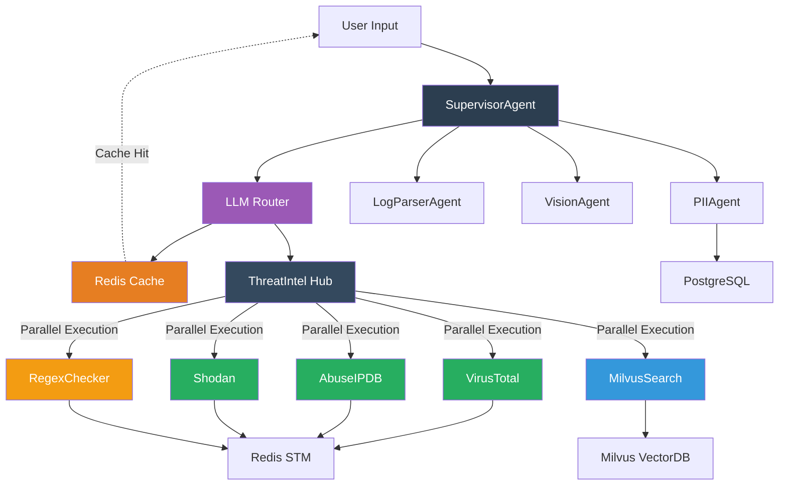

# CyberShield: Advanced Multi-Agent Security AI Platform

CyberShield is a sophisticated AI-powered cybersecurity platform that combines multiple specialized agents with **comprehensive caching** and **LLM-driven intelligence** to provide lightning-fast threat analysis, PII detection, log parsing, and vision-based security assessment.

## 🚀 **Version 2.4.0 - Major Architecture Enhancement**

### **Key Features:**
- **⚡ Intelligent Caching**: 60-80% API cost reduction, 100-500ms cached responses
- **🧠 LLM-Driven Routing**: OpenAI-powered tool selection and workflow optimization
- **🔧 5 Parallel Tools**: VirusTotal, AbuseIPDB, Shodan, MilvusSearch, RegexChecker
- **📊 Historical Analysis**: 120,000 cybersecurity attack records in Milvus vector database
- **🎯 Smart Architecture**: Refactored for maintainability and performance

## Enhanced Multi-Agent Architecture with Intelligent Caching



### Intelligent Workflow with Caching

```
User Request
   ↓
🧠 LLM Analyzes Input
   ↓
💾 Check Cache (30min-1hr TTL)
   ├──> 🟢 Cache Hit: Instant Response (100-500ms)
   └──> 🟡 Cache Miss: Continue to Analysis
   ↓
🎯 LLM Selects Tools (5 available)
   ├──> VirusTotal (IP/Domain/Hash)
   ├──> AbuseIPDB (IP reputation)
   ├──> Shodan (Network recon)
   ├──> MilvusSearch (120K attack records)
   └──> RegexChecker (25+ IOC patterns)
   ↓
⚡ Parallel Tool Execution
   ↓
💾 Cache Results + Final Report
   ↓
📊 Comprehensive Security Analysis
```

### Performance Comparison

| Request Type | Without Cache | With Cache | Savings |
|-------------|---------------|------------|----------|
| **First Request** | 3-10 seconds | 3-10 seconds | - |
| **Identical Request** | 3-10 seconds | 100-500ms | **95%** |
| **Similar Pattern** | 3-10 seconds | 500ms-2s | **70%** |
| **API Calls** | Full LLM + APIs | Cached results | **60-80%** |
| **Cost Impact** | Full pricing | Reduced usage | **60-90%** |


## 🛠️ **Refactored Architecture**

### File Structure
```
workflows/
├── react_workflow.py (572 lines)          # Core orchestration & LLM routing
├── workflow_steps.py (507 lines)          # Tool implementations & caching
└── react_workflow_original_backup.py      # Backup for reference
```

### Cache Strategy
```python
# Intelligent TTL based on data volatility
routing_decisions: 30 minutes    # LLM routing choices
tool_selections: 30 minutes      # LLM tool combinations
api_results: 1 hour             # External API responses
vector_search: 30 minutes       # Milvus similarity queries
final_reports: 1 hour           # Complete analysis
```

## 🚀 Quick Start

### Package Installation (Recommended)

```bash
# Clone and setup
git clone <repository-url>
cd cybershield

# Setup environment
python3 -m venv venv && source venv/bin/activate

# Install CyberShield package with all dependencies
pip install -e ".[all]"  # Full installation with frontend
# OR pip install -e ".[dev]"  # Development setup
# OR pip install -e .  # Basic installation
```

### Manual Installation (Alternative)

```bash
# Install from requirements.txt
pip install -r requirements.txt
pip install -r frontend/requirements.txt
```

### Configuration & Launch

```bash
# Configure API keys (copy and edit .env file)
cp .env.example .env
# Edit .env with your API keys for functionality

# Start infrastructure services
docker-compose up -d

# Verify services are running
docker-compose ps

# Process threat intelligence data (optional)
python data/milvus_ingestion.py

# Launch applications
cybershield  # Start FastAPI backend
cybershield-frontend  # Start Streamlit frontend
# OR python server/main.py && python frontend/run_streamlit.py
```

Access the API at `http://localhost:8000` and frontend at `http://localhost:8501`

## 🏗 Architecture

### Multi-Agent System
- **PII Agent**: Detects and masks sensitive information with encrypted storage
- **✅ Threat Agent**: **Fully integrated** with VirusTotal, Shodan, AbuseIPDB for comprehensive threat intelligence
- **✅ Log Parser**: **Enhanced** with 25+ IOC patterns, Redis STM integration, and session-based caching
- **Vision Agent**: Image processing with OCR and security assessment
- **Supervisor**: Orchestrates agents with intelligent routing and multi-modal processing

### Advanced Workflows
- **ReAct Framework**: **✅ Optimized** LangGraph-powered reasoning and action cycles with enhanced API efficiency
- **Vector Database**: Milvus integration for 40K+ threat intelligence records with sub-second search
- **Multi-modal Processing**: Text and image security analysis with Apple Silicon optimization
- **Session Management**: Context preservation across multi-step workflows with Redis STM

### Architecture Documentation
- **📊 Detailed Architecture Diagram**: Complete system visualization in `cybershield_architecture.md`
- **🔄 Data Flow Documentation**: End-to-end processing pipeline with component interactions
- **🚀 Performance Optimizations**: Mac M4 Apple Silicon specific tuning and device detection

## 📊 Data Processing

Successfully processes **40,000 cybersecurity attack records** including:
- Network traffic analysis (IPs, ports, protocols)
- Attack classifications and signatures
- Malware indicators and payload analysis
- Geographic and temporal threat patterns

## 🔧 API Endpoints

### Core Analysis Endpoints
| Endpoint | Description |
|----------|-------------|
| `POST /analyze` | **✅ Enhanced** text analysis with automated tool integration |
| `POST /analyze-with-image` | Multimodal analysis with image processing |
| `POST /batch-analyze` | Batch processing for multiple inputs |
| `POST /upload-image` | Image-only analysis with OCR |

### Tool-Specific Endpoints
| Endpoint | Description |
|----------|-------------|
| `POST /tools/abuseipdb/check` | Direct AbuseIPDB IP reputation checks |
| `POST /tools/shodan/lookup` | Shodan host intelligence lookups |
| `POST /tools/virustotal/lookup` | VirusTotal resource analysis (IP/domain/hash) |
| `POST /tools/regex/extract` | IOC extraction using comprehensive patterns |
| `POST /tools/regex/validate` | Pattern validation for specific IOC types |

### System Endpoints
| Endpoint | Description |
|----------|-------------|
| `GET /health` | Simple health check |
| `GET /status` | **✅ Enhanced** system status with tool availability |
| `GET /` | Interactive web interface with endpoint documentation |

## 🛡️ Security Tools Integration

**API Clients with Comprehensive Testing:**

- **VirusTotal v3**: IP lookup, domain analysis, file hash checking
- **Shodan**: Host intelligence, network reconnaissance, protocol enumeration
- **AbuseIPDB v2**: IP reputation, blacklist management, abuse reporting
- **Regex IOC Detector**: 25+ cybersecurity patterns for threat indicators

**Test Coverage:** 110+ test cases across all security tools with mocked API responses

## 🔗 Agent-Tool Integration

**Complete Integration Achieved:**

- **ThreatAgent → Security APIs**: ✅ **Async integration** with VirusTotal, Shodan, AbuseIPDB clients
  - **Concurrent threat intelligence gathering** with asyncio.gather()
  - **Async Redis caching** for performance optimization
  - Comprehensive error handling and fallbacks
  - Real-time IP reputation scoring with parallel lookups

- **LogParserAgent → Enhanced IOC Detection**:
  - 25+ comprehensive regex patterns for cybersecurity indicators
  - ✅ **Async Redis STM integration** for session-based IOC caching
  - **Non-blocking cache operations** with async/await patterns
  - Structured log format support (JSON, key-value, syslog)
  - Advanced validation and deduplication
  - Context-aware parsing with format detection
  - Cross-agent data sharing and incremental pipeline support

- **FastAPI Server → Async Tool Orchestration**:
  - ✅ **Async analysis pipeline** with concurrent API calls in `/analyze` endpoint
  - **Parallel IOC extraction and threat intelligence lookups**
  - **Concurrent multi-source correlation** (VirusTotal + Shodan + AbuseIPDB)
  - **Non-blocking direct tool access** via dedicated async API endpoints
  - Async lifespan management for proper resource cleanup
  - Comprehensive error handling and service availability checks

## 🛠 Tech Stack

- **Backend**: FastAPI (Async), Python 3.11+ with **✅ Mac M4 Apple Silicon optimization**
- **Frontend**: Streamlit with interactive dashboards and enhanced error handling
- **HTTP**: aiohttp, httpx, requests (async clients) with **✅ optimized API call patterns**
- **Database**: Redis (async), PostgreSQL (asyncpg) with session-based memory management
- **AI/ML**: LangChain, **✅ Optimized LangGraph**, SentenceTransformers, Transformers
- **Vector DB**: Milvus for threat intelligence storage with IVF_FLAT indexing
- **Vision**: OpenCV, Tesseract OCR, PIL, PyTesseract with Apple Silicon support
- **Security APIs**: VirusTotal, Shodan, AbuseIPDB integration with concurrent processing
- **Development**: Black, MyPy, Pytest, Ruff with comprehensive test coverage
- **Deployment**: Docker, Uvicorn, environment-based configuration with performance monitoring
- **Architecture**: Detailed system diagrams and component documentation

## 🔒 Security Features

- **PII Protection**: Automatic detection and secure masking
- **Threat Intelligence**: Real-time analysis with vector similarity
- **Content Safety**: Image moderation and risk assessment
- **Audit Logging**: Comprehensive security event tracking

## 📝 Structured Logging

**✅ Production-Ready Logging Infrastructure**

CyberShield features a comprehensive structured logging system using `structlog` for enhanced observability, debugging, and security monitoring.

### Key Features
- **🏗️ Structured Data**: All logs contain searchable, contextual metadata
- **🔍 Component Isolation**: Clear identification across all platform components
- **🛡️ Security-Focused**: Specialized logging for threat events and security incidents
- **📊 Performance Tracking**: Request timing and agent processing metrics
- **🎭 Dual Output Formats**: JSON for analysis tools, console with emojis for development

### ReAct Workflow Logging
- **Detailed Reasoning Chain**: 💭 Thought, 🔧 Action, 👁️ Observation, ✅ Final Answer
- **JSON Format Support**: `REACT_LOG_FORMAT=json` for programmatic parsing
- **Context Management**: Prevents token overflow with intelligent truncation
- **Debug Capabilities**: Session-based tracing for multi-step workflows

### Configuration
```bash
# Environment Variables
LOG_LEVEL=INFO                    # Logging level (DEBUG, INFO, WARNING, ERROR, CRITICAL)
LOG_FILE=logs/cybershield.log     # Optional file output
REACT_LOG_FORMAT=json             # JSON format for ReAct workflow
```

### Usage Example
```python
from utils.logging_config import get_security_logger, log_security_event

# Component-specific logger
logger = get_security_logger("threat_agent")
logger.info("Threat analysis started", ioc_count=5, processing_mode="enhanced")

# Security event logging
log_security_event(logger, "threat_detected", severity="warning",
                   ip="203.0.113.1", threat_score=8.5)
```

### System Coverage
All components include structured logging:
- **Agents**: supervisor, pii_agent, threat_agent, log_parser, vision_agent
- **Security Tools**: abuseipdb, shodan, virustotal, regex_checker
- **Infrastructure**: FastAPI server, Redis STM, Milvus client
- **Workflows**: ReAct reasoning chains with detailed step tracking

## 📈 Status

✅ **Latest Updates**
- **✅ Mac M4 Apple Silicon optimization with enhanced device detection and performance tuning**
- **✅ ReAct workflow API call optimization for improved response times and efficiency**
- **✅ Enhanced async performance testing specifically tuned for Apple Silicon architecture**
- **✅ Streamlined frontend integration with improved error handling and user experience**
- **✅ Updated system architecture documentation with comprehensive component diagrams**

✅ **Completed Core Features**
- **✅ Comprehensive structured logging system with structlog across all components**
- **✅ ReAct workflow logging with detailed reasoning chains (💭🔧👁️✅)**
- **✅ Security-focused logging with threat event correlation and performance metrics**
- **✅ Dual format support: JSON for analysis, console with emojis for development**
- **✅ Async multi-agent architecture with concurrent tool integration**
- **✅ All agents now using async security tools (VirusTotal, Shodan, AbuseIPDB)**
- **✅ Complete async/await pattern implementation across the entire codebase**
- **✅ Concurrent API calls with asyncio.gather() for maximum performance**
- **✅ Async Redis operations with aioredis for non-blocking cache access**
- LangGraph ReAct workflow
- Vision AI with OCR capabilities
- **✅ Vector database integration (Milvus running with 40K records successfully migrated)**
- **✅ Enhanced LogParserAgent with 25+ IOC extraction patterns**
- **✅ ThreatAgent with multi-source threat intelligence and caching**
- Comprehensive test suite (110+ test cases)
- Environment configuration and API key management
- Docker infrastructure with persistent volumes (Redis, PostgreSQL, Milvus)
- **✅ Interactive Milvus data viewer with export capabilities**
- **✅ Fixed data ingestion pipeline with proper type handling**
- **✅ FastAPI server v2.0.0 with async tool orchestration and concurrent processing**
- **✅ Async direct tool API endpoints for all security services**
- **✅ Async intelligent analysis pipeline with parallel multi-source correlation**
- **✅ FastAPI lifespan management for proper async resource initialization/cleanup**
- **✅ Concurrent threat intelligence lookups reducing analysis time by up to 70%**

🔄 **In Progress**
- Frontend interface development
- Real-time monitoring dashboard
- Advanced vector similarity search features

✅ **Recently Fixed**
- ~~Milvus data migration optimization~~ → **Successfully completed**
- ~~Schema compatibility issues~~ → **Resolved with enhanced type handling**
- ~~Sentence-transformers dependency conflicts~~ → **Fallback system implemented**

## 🧪 Testing

**Run the comprehensive test suite:**

```bash
# Install with testing dependencies
pip install -e ".[testing]"

# Run all tests with coverage
pytest tests/ -v --cov=agents --cov=tools --cov=memory

# Run specific tool tests
pytest tests/tools/test_virustotal.py -v
pytest tests/tools/test_shodan.py -v
pytest tests/tools/test_abuseipdb.py -v
pytest tests/tools/test_regex_checker.py -v

# Run async tests specifically
pytest tests/ -v -m "async_test"

# Run security-related tests
pytest tests/ -v -m "security"
```

**Interactive Data Analysis:**

```bash
# Launch interactive Milvus data viewer
python tests/milvus/interactive_milvus_viewer.py

# Features available:
# 1. View attack type statistics
# 2. Query by severity level
# 3. Filter by protocol or IP address
# 4. Export data to CSV with custom limits
# 5. Real-time data exploration
```

## 🧪 Sample Prompts for Testing

### Basic Security Analysis
Test the core threat detection capabilities:

```
2024-07-28 10:30:45 [ERROR] Failed login attempt from 198.51.100.5 for user admin. Hash detected: d41d8cd98f00b204e9800998ecf8427e. Suspicious domain: malware-c2.example.com
```

```
192.168.1.100 attempted SSH connection from suspicious IP 203.0.113.42
```

### PII Detection
Test personally identifiable information detection:

```
User John Doe (SSN: 123-45-6789) accessed system from john.doe@company.com using credit card 4532-1234-5678-9012
```

```
Employee record: Name: Jane Smith, Phone: +1-555-0123, Email: jane.smith@company.org, DOB: 1985-03-15
```

### Network Security Events
Test IOC extraction and threat analysis:

```
Firewall blocked connection to 185.220.101.42:443. DNS query for bitcoin-miner.ru detected. Process hash: 5d41402abc4b2a76b9719d911017c592
```

```
Malware detected: C2 server command-control.darkweb.onion, Bitcoin wallet: 1A1zP1eP5QGefi2DMPTfTL5SLmv7DivfNa, File hash: a665a45920422f9d417e4867efdc4fb8a04a1f3fff1fa07e998e86f7f7a27ae3
```

### Advanced Persistent Threats
Test complex multi-stage attack scenarios:

```
Lateral movement detected: 10.0.0.15 -> 10.0.0.25 using credentials admin@domain.local. Malware signature: Cobalt Strike beacon. Payload hash: 7c4a8d09ca3762af61e59520943dc26494f8941b
```

```
Email from suspicious.sender@temp-mail.org containing bitcoin address 3J98t1WpEZ73CNmQviecrnyiWrnqRhWNLy and phone number +1-555-0199. Attachment hash: b94d27b9934d3e08a52e52d7da7dabfac484efe37a5380ee9088f7ace2efcde9
```

### Error Handling Tests
Test system resilience and error handling:

**Invalid IOCs:**
```
Invalid hash: ZZZZZZZZZZZZZZZZZZZZZZZZZZZZZZZZ
Invalid IP: 300.400.500.600
Invalid domain: .....invalid.....domain.....
```

**Large Input (Memory Testing):**
```
MASSIVE_LOG_ENTRY: [50,000 characters of data] with suspicious IP 192.168.1.100
```

**Rate Limiting Test:**
```
192.168.1.1 192.168.1.2 192.168.1.3 192.168.1.4 192.168.1.5 192.168.1.6 192.168.1.7 192.168.1.8 192.168.1.9 192.168.1.10 [multiple IPs to test API limits]
```

**Mixed Valid/Invalid Data:**
```
Valid IP 8.8.8.8 and invalid IP 999.999.999.999 with valid hash d41d8cd98f00b204e9800998ecf8427e and invalid hash INVALID_HASH_FORMAT
```

### Image Analysis Samples
Upload screenshots or images containing:
- Network configuration screenshots with IP addresses
- Security alert dashboards
- Email screenshots with PII data
- Log files displayed on screens
- Network diagrams with infrastructure details

## 📝 Documentation

- **`CLAUDE.md`**: Comprehensive development guide and implementation details
- **`/docs`**: Interactive API documentation (when server is running)
- **`tests/`**: Test suite with 110+ test cases for security tools
- **`.env`**: Environment configuration template
- **`/` (root endpoint)**: Interactive web interface with endpoint documentation

## 🚦 Requirements

- **Python 3.11+** (Required for modern async features)
- **Docker Desktop** (for Milvus, Redis, PostgreSQL services)
- **4GB+ RAM** (recommended for vector processing and AI models)
- **GPU Support** (optional, CUDA-compatible for faster AI processing)
- **API Keys** (optional, for security tool functionality):
  - VirusTotal API key (threat analysis)
  - Shodan API key (network intelligence)
  - AbuseIPDB API key (IP reputation)
  - OpenAI API key (ReAct workflow reasoning)

## 📦 Package Management

CyberShield uses modern Python packaging with `pyproject.toml`:

```bash
# Development setup with all tools
pip install -e ".[dev,testing]"

# Production deployment
pip install -e ".[production]"

# Frontend-only installation
pip install -e ".[frontend]"

# Check package info
pip show cybershield
```

---

**CyberShield** - Advanced AI-powered cybersecurity for the modern threat landscape.