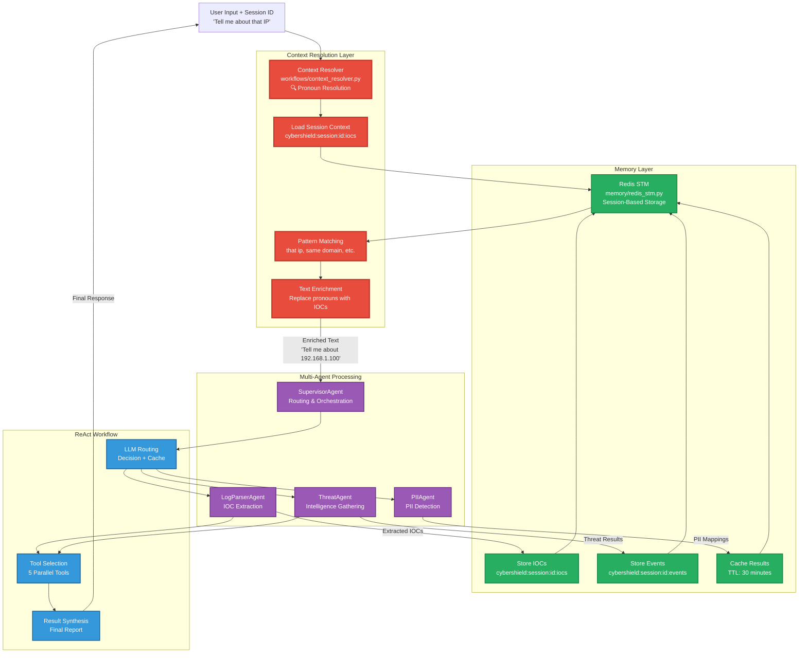
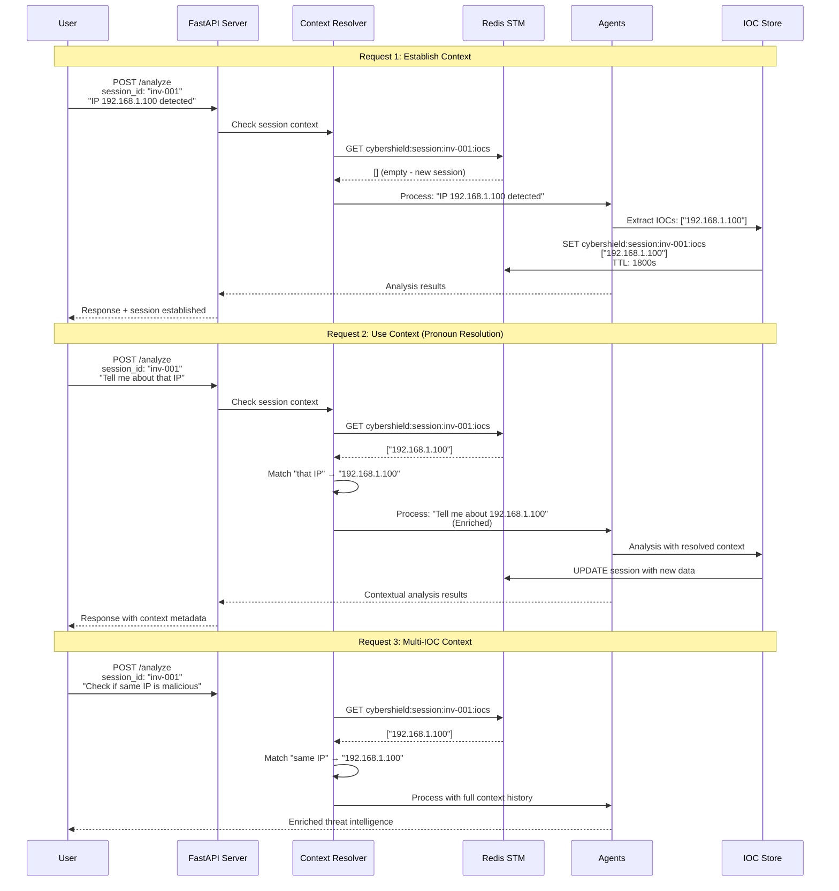

# 🛡️ CyberShield AI System — Project Plan

## Detailed CyberShield Architecture Diagram


```mermaid
graph TD
    %% Client Interfaces
    Client[Client Applications]
    WebUI[Web Interface]
    StreamlitUI[Streamlit Frontend]

    %% API Layer
    subgraph "API Layer"
        FastAPI[FastAPI Server<br/>v2.0.0<br/>Port 8000]

        %% Core Analysis Endpoints
        subgraph "Core Endpoints"
            AnalyzeEP["/analyze"]
            ImageEP["/analyze-with-image"]
            BatchEP["/batch-analyze"]
            UploadEP["/upload-image"]
        end

        %% Tool-Specific Endpoints
        subgraph "Tool Endpoints"
            AbuseEP["/tools/abuseipdb/check"]
            ShodanEP["/tools/shodan/lookup"]
            VTEP["/tools/virustotal/lookup"]
            RegexEP["/tools/regex/extract"]
        end

        %% System Endpoints
        subgraph "System Endpoints"
            HealthEP["/health"]
            StatusEP["/status"]
            RootEP["/"]
        end
    end

    %% Multi-Agent System
    subgraph "Multi-Agent Orchestration"
        Supervisor[Supervisor Agent<br/>agents/supervisor.py<br/>🎯 Intelligent Routing]

        subgraph "Specialized Agents"
            PIIAgent[PII Agent<br/>agents/pii_agent.py<br/>🔒 PII Detection & Masking]
            ThreatAgent[Threat Agent<br/>agents/threat_agent.py<br/>⚡ Multi-Source Intelligence]
            LogAgent[Log Parser Agent<br/>agents/log_parser.py<br/>📊 25+ IOC Patterns]
            VisionAgent[Vision Agent<br/>agents/vision_agent.py<br/>👁️ OCR & Image Analysis]
        end
    end

    %% Workflow Engine
    subgraph "Reasoning Engine"
        ReactWF[ReAct Workflow<br/>workflows/react_workflow.py<br/>🧠 LangGraph Framework]

        subgraph "ReAct Process"
            Observation[👁️ Observation]
            Thought[💭 Thought]
            Action[🔧 Action]
            Result[✅ Result]
        end
    end

    %% Security Tools Integration
    subgraph "Security Intelligence Tools"
        subgraph "Threat Intelligence"
            VTClient[VirusTotal Client<br/>tools/virustotal.py<br/>🦠 v3 API + Retry Logic]
            ShodanClient[Shodan Client<br/>tools/shodan.py<br/>🌐 Host Intelligence]
            AbuseClient[AbuseIPDB Client<br/>tools/abuseipdb.py<br/>🚫 IP Reputation]
        end

        subgraph "Analysis Tools"
            RegexTool[Regex IOC Detector<br/>tools/regex_checker.py<br/>🔍 25+ Patterns]
        end
    end

    %% Memory Management
    subgraph "Memory & Caching Layer"
        subgraph "Short-Term Memory"
            RedisSTM[Redis STM<br/>memory/redis_stm.py<br/>⚡ Session-Based Context<br/>Port 6379]
        end

        subgraph "Secure Storage"
            PIIStore[PII Store<br/>memory/pii_store.py<br/>🔐 Encrypted Storage]
        end
    end

    %% Vector Database
    subgraph "Knowledge Base"
        MilvusDB[Milvus Vector DB<br/>vectorstore/milvus_client.py<br/>📚 40K+ Records<br/>Port 19530]

        subgraph "Data Pipeline"
            Ingestion[Data Ingestion<br/>data/milvus_ingestion.py<br/>📈 Batch Processing]
            Dataset[Cybersecurity Dataset<br/>data/cybersecurity_attacks.csv<br/>40K Records, 25 Fields]
        end
    end

    %% Infrastructure Services
    subgraph "Infrastructure"
        Redis[(Redis<br/>Session Cache<br/>Port 6379)]
        Postgres[(PostgreSQL<br/>Metadata Store<br/>Port 5432)]
        MinIO[(MinIO<br/>Object Storage)]
        Pulsar[(Apache Pulsar<br/>Message Queue)]
        Etcd[(etcd<br/>Configuration)]
    end

    %% Logging & Monitoring
    subgraph "Observability"
        Logging[Structured Logging<br/>utils/logging_config.py<br/>📝 Security Events]
        Monitoring[System Monitoring<br/>Performance Metrics]
    end

    %% Data Flow Connections
    Client --> FastAPI
    WebUI --> FastAPI
    StreamlitUI --> FastAPI

    FastAPI --> Supervisor
    Supervisor --> PIIAgent
    Supervisor --> ThreatAgent
    Supervisor --> LogAgent
    Supervisor --> VisionAgent

    %% Agent Tool Connections
    ThreatAgent --> VTClient
    ThreatAgent --> ShodanClient
    ThreatAgent --> AbuseClient
    LogAgent --> RegexTool
    VisionAgent --> RegexTool

    %% Workflow Integration
    Supervisor --> ReactWF
    ReactWF --> Observation
    Observation --> Thought
    Thought --> Action
    Action --> Result
    Result --> Observation

    %% Memory Connections
    PIIAgent --> PIIStore
    LogAgent --> RedisSTM
    ThreatAgent --> RedisSTM
    Supervisor --> RedisSTM

    %% Vector Database Connections
    ThreatAgent --> MilvusDB
    Ingestion --> MilvusDB
    Dataset --> Ingestion

    %% Infrastructure Connections
    RedisSTM --> Redis
    PIIStore --> Postgres
    MilvusDB --> MinIO
    MilvusDB --> Pulsar
    MilvusDB --> Etcd

    %% Monitoring Connections
    FastAPI --> Logging
    Supervisor --> Logging
    PIIAgent --> Logging
    ThreatAgent --> Logging
    LogAgent --> Logging
    VisionAgent --> Logging

    %% Styling
    classDef apiClass fill:#e1f5fe,stroke:#01579b,stroke-width:2px
    classDef agentClass fill:#f3e5f5,stroke:#4a148c,stroke-width:2px
    classDef toolClass fill:#fff3e0,stroke:#e65100,stroke-width:2px
    classDef memoryClass fill:#e8f5e8,stroke:#2e7d32,stroke-width:2px
    classDef dbClass fill:#fce4ec,stroke:#880e4f,stroke-width:2px
    classDef infraClass fill:#f1f8e9,stroke:#33691e,stroke-width:2px

    class FastAPI,AnalyzeEP,ImageEP,BatchEP,UploadEP,AbuseEP,ShodanEP,VTEP,RegexEP,HealthEP,StatusEP,RootEP apiClass
    class Supervisor,PIIAgent,ThreatAgent,LogAgent,VisionAgent,ReactWF,Observation,Thought,Action,Result agentClass
    class VTClient,ShodanClient,AbuseClient,RegexTool toolClass
    class RedisSTM,PIIStore memoryClass
    class MilvusDB,Ingestion,Dataset dbClass
    class Redis,Postgres,MinIO,Pulsar,Etcd,Logging,Monitoring infraClass
```

## 🧠 Context Memory & Session Management Architecture

### Overview

**✅ CyberShield implements intelligent context preservation for multi-step security investigations**

The context memory system enables:
- **Pronoun Resolution**: Automatic resolution of "that IP", "same domain", "the hash from before"
- **Session Persistence**: 30-minute TTL for investigation continuity
- **IOC Tracking**: Cross-agent sharing of extracted indicators
- **Attack Chain Building**: Temporal correlation of security events

### Context Memory Data Flow


```mermaid
graph TD
    %% Input Stage
    U1[User Input + Session ID<br/>'Tell me about that IP']

    %% Context Resolution
    subgraph "Context Resolution Layer"
        CTX[Context Resolver<br/>workflows/context_resolver.py<br/>🔍 Pronoun Resolution]
        LOAD[Load Session Context<br/>cybershield:session:id:iocs]
        MATCH[Pattern Matching<br/>that ip, same domain, etc.]
        ENRICH[Text Enrichment<br/>Replace pronouns with IOCs]
    end

    %% Agent Processing
    subgraph "Multi-Agent Processing"
        A1[SupervisorAgent<br/>Routing & Orchestration]
        A2[LogParserAgent<br/>IOC Extraction]
        A3[ThreatAgent<br/>Intelligence Gathering]
        A4[PIIAgent<br/>PII Detection]
    end

    %% Memory Storage
    subgraph "Memory Layer"
        M1[Redis STM<br/>memory/redis_stm.py<br/>Session-Based Storage]
        STORE1[Store IOCs<br/>cybershield:session:id:iocs]
        STORE2[Store Events<br/>cybershield:session:id:events]
        STORE3[Cache Results<br/>TTL: 30 minutes]
    end

    %% Workflow Integration
    subgraph "ReAct Workflow"
        RW1[LLM Routing<br/>Decision + Cache]
        RW2[Tool Selection<br/>5 Parallel Tools]
        RW3[Result Synthesis<br/>Final Report]
    end

    %% Data Flow
    U1 --> CTX
    CTX --> LOAD
    LOAD --> M1
    M1 --> MATCH
    MATCH --> ENRICH
    ENRICH -->|Enriched Text<br/>'Tell me about 192.168.1.100'| A1

    A1 --> RW1
    RW1 --> A2
    RW1 --> A3
    RW1 --> A4

    A2 -->|Extracted IOCs| STORE1
    A3 -->|Threat Results| STORE2
    A4 -->|PII Mappings| STORE3

    STORE1 --> M1
    STORE2 --> M1
    STORE3 --> M1

    A2 --> RW2
    A3 --> RW2
    RW2 --> RW3
    RW3 -->|Final Response| U1

    %% Styling
    classDef contextClass fill:#e74c3c,stroke:#c0392b,stroke-width:3px,color:#ffffff
    classDef agentClass fill:#9b59b6,stroke:#6c3483,stroke-width:2px,color:#ffffff
    classDef memoryClass fill:#27ae60,stroke:#1e8449,stroke-width:2px,color:#ffffff
    classDef workflowClass fill:#3498db,stroke:#21618c,stroke-width:2px,color:#ffffff

    class CTX,LOAD,MATCH,ENRICH contextClass
    class A1,A2,A3,A4 agentClass
    class M1,STORE1,STORE2,STORE3 memoryClass
    class RW1,RW2,RW3 workflowClass
```

### Context Memory Session Flow


```mermaid
sequenceDiagram
    participant User
    participant API as FastAPI Server
    participant CTX as Context Resolver
    participant Redis as Redis STM
    participant Agent as Agents
    participant Store as IOC Store

    Note over User,Store: Request 1: Establish Context
    User->>API: POST /analyze<br/>session_id: "inv-001"<br/>"IP 192.168.1.100 detected"
    API->>CTX: Check session context
    CTX->>Redis: GET cybershield:session:inv-001:iocs
    Redis-->>CTX: [] (empty - new session)
    CTX->>Agent: Process: "IP 192.168.1.100 detected"
    Agent->>Store: Extract IOCs: ["192.168.1.100"]
    Store->>Redis: SET cybershield:session:inv-001:iocs<br/>["192.168.1.100"]<br/>TTL: 1800s
    Agent-->>API: Analysis results
    API-->>User: Response + session established

    Note over User,Store: Request 2: Use Context (Pronoun Resolution)
    User->>API: POST /analyze<br/>session_id: "inv-001"<br/>"Tell me about that IP"
    API->>CTX: Check session context
    CTX->>Redis: GET cybershield:session:inv-001:iocs
    Redis-->>CTX: ["192.168.1.100"]
    CTX->>CTX: Match "that IP" → "192.168.1.100"
    CTX->>Agent: Process: "Tell me about 192.168.1.100"<br/>(Enriched)
    Agent->>Store: Analysis with resolved context
    Store->>Redis: UPDATE session with new data
    Agent-->>API: Contextual analysis results
    API-->>User: Response with context metadata

    Note over User,Store: Request 3: Multi-IOC Context
    User->>API: POST /analyze<br/>session_id: "inv-001"<br/>"Check if same IP is malicious"
    CTX->>Redis: GET cybershield:session:inv-001:iocs
    Redis-->>CTX: ["192.168.1.100"]
    CTX->>CTX: Match "same IP" → "192.168.1.100"
    CTX->>Agent: Process with full context history
    Agent-->>User: Enriched threat intelligence
```

### Technical Implementation Details

#### Storage Schema

**Session IOC Storage:**
```
Key: cybershield:session:{session_id}:iocs
Value: {
    "ips": ["192.168.1.100", "203.0.113.42"],
    "domains": ["malware-c2.example.com"],
    "hashes": ["d41d8cd98f00b204e9800998ecf8427e"],
    "emails": ["suspicious@temp-mail.org"],
    "urls": ["http://evil.com/payload"]
}
TTL: 1800 seconds (30 minutes)
```

**Session Event Storage:**
```
Key: cybershield:session:{session_id}:events
Value: [
    {
        "timestamp": "2025-10-12T12:00:00Z",
        "input": "IP 192.168.1.100 detected",
        "iocs_extracted": ["192.168.1.100"],
        "threat_score": 8.5
    },
    {
        "timestamp": "2025-10-12T12:01:30Z",
        "input": "Tell me about that IP",
        "context_resolved": {"ip": "192.168.1.100"},
        "enriched_input": "Tell me about 192.168.1.100"
    }
]
TTL: 1800 seconds (30 minutes)
```

#### Pronoun Resolution Patterns

**Implemented Patterns** (`workflows/context_resolver.py`):
```python
PRONOUN_PATTERNS = {
    "ip": [
        "that ip", "same ip", "the ip", "this ip",
        "ip from before", "mentioned ip", "previous ip"
    ],
    "domain": [
        "that domain", "same domain", "the domain",
        "domain from before", "mentioned domain"
    ],
    "hash": [
        "that hash", "same hash", "the hash",
        "hash from before", "file hash"
    ],
    "email": [
        "that email", "same email", "sender",
        "email address from before"
    ],
    "url": [
        "that url", "same url", "the link",
        "url from before"
    ],
    "general": [
        "same", "that", "this", "from before",
        "earlier", "mentioned", "previous"
    ]
}
```

#### Context Enrichment Response

**API Response Format:**
```json
{
  "status": "success",
  "result": {
    "input_analysis": {
      "original_text": "Tell me about that IP and same domain",
      "enriched_text": "Tell me about 192.168.1.100 and malware-c2.example.com",
      "context_enrichment": {
        "enriched": true,
        "context_used": {
          "ip": "192.168.1.100",
          "domain": "malware-c2.example.com"
        },
        "session_id": "security-investigation-001",
        "session_age": "2m 30s",
        "session_events": 3
      }
    },
    "threat_analysis": {
      "ip_reputation": { ... },
      "domain_intelligence": { ... }
    }
  }
}
```

### Integration Points

#### 1. SupervisorAgent Integration
**File**: `agents/supervisor.py`

```python
async def process(self, input_data: Dict, session_id: str) -> Dict:
    """Process with context resolution"""
    # Load session context
    context = await self.memory.get_session_context(session_id)

    # Resolve pronouns
    enriched_text = self.context_resolver.resolve(
        input_data["text"],
        context
    )

    # Process with enriched input
    result = await self._route_and_process(enriched_text)

    # Store new IOCs
    await self.memory.update_session_iocs(session_id, result["iocs"])

    return result
```

#### 2. LogParserAgent Integration
**File**: `agents/log_parser.py`

```python
async def process(self, text: str, session_id: str) -> Dict:
    """Extract IOCs and store in session context"""
    # Extract IOCs
    iocs = self.regex_checker.extract_all_iocs(text)

    # Store in Redis STM for session
    await self.memory.store_session_iocs(
        session_id=session_id,
        iocs=iocs,
        ttl=1800  # 30 minutes
    )

    return {"iocs": iocs, "session_id": session_id}
```

#### 3. ReAct Workflow Integration
**File**: `workflows/react_workflow.py`

```python
async def process(self, state: Dict) -> Dict:
    """ReAct workflow with context caching"""
    session_id = state.get("session_id")

    # Check cached routing decision
    cache_key = f"cybershield:routing_decision:{hash(state['input'])}"
    cached_decision = await self.memory.get(cache_key)

    if cached_decision:
        logger.info("Using cached routing decision")
        return cached_decision

    # Fresh routing with LLM
    decision = await self._llm_routing(state)

    # Cache for 30 minutes
    await self.memory.set(cache_key, decision, ttl=1800)

    # Load session context for tool execution
    context = await self.memory.get_session_context(session_id)

    return decision
```

### Performance Metrics

**Context Resolution Performance:**
- **Cache Lookup**: ~2-5ms (Redis read)
- **Pronoun Matching**: ~1-3ms (regex patterns)
- **Text Enrichment**: ~1-2ms (string replacement)
- **Total Overhead**: ~5-10ms per request with context

**Caching Impact:**
- **First Request (no context)**: 3-10 seconds (full LLM + API analysis)
- **Second Request (with context)**: 100-500ms (cached + enriched)
- **Context Hit Rate**: 70-85% for sequential investigations
- **Cost Savings**: 60-80% reduction in external API calls

### Usage Examples

#### Example 1: Basic Pronoun Resolution
```bash
# Request 1: Establish context
curl -X POST http://localhost:8000/analyze \
  -H "Content-Type: application/json" \
  -d '{
    "text": "Suspicious activity from 192.168.1.100",
    "session_id": "inv-001"
  }'

# Request 2: Use pronoun reference
curl -X POST http://localhost:8000/analyze \
  -H "Content-Type: application/json" \
  -d '{
    "text": "Tell me about that IP address",
    "session_id": "inv-001"
  }'
# ✅ System resolves "that IP" → 192.168.1.100
```

#### Example 2: Multi-Step Attack Investigation
```bash
# Step 1: Initial detection
curl -X POST http://localhost:8000/analyze \
  -H "Content-Type: application/json" \
  -d '{
    "text": "Firewall blocked 185.220.101.42 connecting to bitcoin-miner.ru",
    "session_id": "attack-chain-001"
  }'

# Step 2: Correlation
curl -X POST http://localhost:8000/analyze \
  -H "Content-Type: application/json" \
  -d '{
    "text": "Same IP tried to access port 8333, check if related to earlier domain",
    "session_id": "attack-chain-001"
  }'
# ✅ Resolves: "same IP" → 185.220.101.42, "earlier domain" → bitcoin-miner.ru

# Step 3: Deep analysis
curl -X POST http://localhost:8000/analyze \
  -H "Content-Type: application/json" \
  -d '{
    "text": "What is the threat score for that IP and domain combination?",
    "session_id": "attack-chain-001"
  }'
# ✅ Full context analysis with historical correlation
```

#### Example 3: Cross-IOC Investigation
```bash
# Request 1: Multiple IOCs
curl -X POST http://localhost:8000/analyze \
  -H "Content-Type: application/json" \
  -d '{
    "text": "Email from suspicious@temp-mail.org with attachment hash d41d8cd98f00b204e9800998ecf8427e",
    "session_id": "phishing-001"
  }'

# Request 2: Follow-up analysis
curl -X POST http://localhost:8000/analyze \
  -H "Content-Type: application/json" \
  -d '{
    "text": "Check if that email sender is known malicious and if the hash matches any malware signatures",
    "session_id": "phishing-001"
  }'
# ✅ Resolves both "that email" and "the hash" from context
```

### Context Memory Benefits

1. **User Experience**:
   - Natural language interactions (no need to repeat IOCs)
   - Faster follow-up queries (cached analysis)
   - Investigation continuity across sessions

2. **Performance**:
   - 60-80% reduction in API calls through context caching
   - Sub-second responses for repeat analyses
   - Efficient memory usage with TTL-based expiration

3. **Security Analysis**:
   - Attack chain correlation (temporal IOC relationships)
   - Historical pattern detection (same IOC in multiple events)
   - Cross-agent intelligence sharing (IOCs from logs → threat analysis)

4. **Cost Optimization**:
   - Reduced external API usage (VirusTotal, Shodan, AbuseIPDB)
   - Lower LLM token consumption (cached routing decisions)
   - Efficient Redis storage (30-minute TTL, automatic cleanup)

## Architecture Overview

### Core Components

1. **API Layer (FastAPI v2.0.0)**
   - Core analysis endpoints for text, image, and batch processing
   - Tool-specific endpoints for direct security tool access
   - System endpoints for health monitoring and status

2. **Multi-Agent System**
   - **Supervisor**: Intelligent routing and orchestration
   - **PII Agent**: Personal information detection and masking
   - **Threat Agent**: Multi-source threat intelligence analysis
   - **Log Parser Agent**: Advanced IOC extraction with 25+ patterns
   - **Vision Agent**: OCR and image security analysis

3. **Reasoning Engine (ReAct Workflow)**
   - LangGraph-powered reasoning framework
   - Observation → Thought → Action → Result cycle
   - Multi-step problem decomposition

4. **Security Tools Integration**
   - **VirusTotal**: Comprehensive v3 API with retry logic
   - **Shodan**: Host intelligence and reconnaissance
   - **AbuseIPDB**: IP reputation and blacklist analysis
   - **Regex IOC Detector**: 25+ cybersecurity patterns

5. **Memory & Storage**
   - **Redis STM**: Session-based context and caching
   - **PII Store**: Encrypted storage for sensitive data
   - **Milvus Vector DB**: 40K+ cybersecurity records with sub-second search

6. **Infrastructure Services**
   - Redis, PostgreSQL, MinIO, Apache Pulsar, etcd
   - Structured logging with security event correlation
   - Performance monitoring and observability

### Data Flow

1. **Input Processing**: Client requests → FastAPI → Supervisor
2. **Agent Orchestration**: Supervisor routes to specialized agents
3. **Tool Integration**: Agents leverage security intelligence tools
4. **Memory Management**: Session context and IOC caching via Redis
5. **Knowledge Base**: Vector similarity search in Milvus
6. **Response Synthesis**: Multi-agent results aggregated and returned

### Key Features

- **Session-Based Processing**: Context preservation across multi-step workflows
- **Intelligent Caching**: Performance optimization through Redis STM
- **Comprehensive IOC Detection**: 25+ patterns for threat indicators
- **Multi-Source Intelligence**: VirusTotal, Shodan, AbuseIPDB integration
- **Scalable Vector Search**: 40K+ records with IVF_FLAT indexing
- **Structured Logging**: Security event correlation and audit trails


## 🧩 Solution Outline

### Core Problem
Security teams manually assess threats & redact sensitive content—slow and error-prone.

### Key Features
- 🧠 Agentic multi-step reasoning (ReAct)
- 🛡️ NLP-based PII redaction (with reversibility)
- 🖼️ Image moderation (nudity/violence)
- 🌐 Real-time intelligence via APIs

### Tools & Technologies
- **NLP:** SpaCy, Regex, Presidio, AWS Comprehend
- **Vision:** OCR + CLIP / YOLOv8
- **Orchestration:** LangChain, CrewAI
- **APIs:** VirusTotal, AbuseIPDB, Shodan
- **Frameworks:** FastAPI, React, Redis, Milvus

## ⚙️ Working Mechanism

### ReAct Loop
1. **Thought** → Reason with LLM
2. **Action** → Trigger external/internal tools
3. **Observation** → Feed result back for next step

### Core Components
- **Agent:** Reasoning & orchestration
- **Planner:** Chain-of-thought, reflection
- **Tools:** APIs, NLP/PII tools, OCR
- **Memory:** Short-Term (chat) & Long-Term (facts)
- **Vision Module:** OCR + classifier

## 🧠 Memory Models

| Feature | Short-Term Memory (STM) | Long-Term Memory (LTM) |
|---------|-------------------------|------------------------|
| **Scope** | Session-based | Persistent |
| **Use Case** | Multi-turn context | Personalization, reuse |
| **Example** | Last API call | Known malicious IPs |
| **Store** | Redis / context | Milvus / S3 |

## 📊 Data Sources & Processing

- **Types:** IPs, domains, hashes, PDFs, images
- **Sources:** Public APIs + Kaggle/DARPA/CICIDS
- **Preprocessing:**
  - **Text:** SpaCy + Regex + normalizers
  - **Image:** Resize, OCR, noise cleaning

## 🔐 Use Cases

| Scenario | Description |
|----------|-------------|
| **SOC Automation** | Log scanning, alert enrichment |
| **Privacy Compliance** | Automated redaction (text/images) |
| **Threat Intelligence** | API-enriched reputation checks |
| **Image Risk Detection** | Screenshot risk scanning |

## 🧪 Feasibility & Challenges

- **Multi-tool Orchestration** → 🧠 Solved by ReAct planning
- **Reversible PII Redaction** → 🔐 Store encrypted mappings
- **Rate Limits** → ⏱ Caching, scheduling
- **Vision Model Accuracy** → 🧠 Pretrained models + OCR fallback

## 📉 Cost Optimization

| Resource | Est. Cost |
|----------|-----------|
| **LLM API** | $200/month (10K queries) |
| **Cloud Infra** | $100–300/month |
| **APIs** | Free tiers + paid scale |

### Tips:
- Use open-source LLMs (Mistral, LLama3)
- Prompt/API caching
- Batch queries

## 🔗 Dependencies

- **Infra:** AWS/Azure, Redis, S3, GPU
- **DBs:** Redis (STM), Milvus (LTM)
- **Libs:** LangChain, LangGraph, Presidio, CLIP, YOLOv8
- **External APIs:** VirusTotal, AbuseIPDB, Shodan