# 🛡️ CyberShield AI System — Project Plan

## Detailed CyberShield Architecture Diagram

```mermaid
graph TD
    %% Client Interfaces
    Client[Client Applications]
    WebUI[Web Interface]
    StreamlitUI[Streamlit Frontend]

    %% API Layer
    subgraph "API Layer"
        FastAPI[FastAPI Server<br/>v2.0.0<br/>Port 8000]

        %% Core Analysis Endpoints
        subgraph "Core Endpoints"
            AnalyzeEP["/analyze"]
            ImageEP["/analyze-with-image"]
            BatchEP["/batch-analyze"]
            UploadEP["/upload-image"]
        end

        %% Tool-Specific Endpoints
        subgraph "Tool Endpoints"
            AbuseEP["/tools/abuseipdb/check"]
            ShodanEP["/tools/shodan/lookup"]
            VTEP["/tools/virustotal/lookup"]
            RegexEP["/tools/regex/extract"]
        end

        %% System Endpoints
        subgraph "System Endpoints"
            HealthEP["/health"]
            StatusEP["/status"]
            RootEP["/"]
        end
    end

    %% Multi-Agent System
    subgraph "Multi-Agent Orchestration"
        Supervisor[Supervisor Agent<br/>agents/supervisor.py<br/>🎯 Intelligent Routing]

        subgraph "Specialized Agents"
            PIIAgent[PII Agent<br/>agents/pii_agent.py<br/>🔒 PII Detection & Masking]
            ThreatAgent[Threat Agent<br/>agents/threat_agent.py<br/>⚡ Multi-Source Intelligence]
            LogAgent[Log Parser Agent<br/>agents/log_parser.py<br/>📊 25+ IOC Patterns]
            VisionAgent[Vision Agent<br/>agents/vision_agent.py<br/>👁️ OCR & Image Analysis]
        end
    end

    %% Workflow Engine
    subgraph "Reasoning Engine"
        ReactWF[ReAct Workflow<br/>workflows/react_workflow.py<br/>🧠 LangGraph Framework]

        subgraph "ReAct Process"
            Observation[👁️ Observation]
            Thought[💭 Thought]
            Action[🔧 Action]
            Result[✅ Result]
        end
    end

    %% Security Tools Integration
    subgraph "Security Intelligence Tools"
        subgraph "Threat Intelligence"
            VTClient[VirusTotal Client<br/>tools/virustotal.py<br/>🦠 v3 API + Retry Logic]
            ShodanClient[Shodan Client<br/>tools/shodan.py<br/>🌐 Host Intelligence]
            AbuseClient[AbuseIPDB Client<br/>tools/abuseipdb.py<br/>🚫 IP Reputation]
        end

        subgraph "Analysis Tools"
            RegexTool[Regex IOC Detector<br/>tools/regex_checker.py<br/>🔍 25+ Patterns]
        end
    end

    %% Memory Management
    subgraph "Memory & Caching Layer"
        subgraph "Short-Term Memory"
            RedisSTM[Redis STM<br/>memory/redis_stm.py<br/>⚡ Session-Based Context<br/>Port 6379]
        end

        subgraph "Secure Storage"
            PIIStore[PII Store<br/>memory/pii_store.py<br/>🔐 Encrypted Storage]
        end
    end

    %% Vector Database
    subgraph "Knowledge Base"
        MilvusDB[Milvus Vector DB<br/>vectorstore/milvus_client.py<br/>📚 40K+ Records<br/>Port 19530]

        subgraph "Data Pipeline"
            Ingestion[Data Ingestion<br/>data/milvus_ingestion.py<br/>📈 Batch Processing]
            Dataset[Cybersecurity Dataset<br/>data/cybersecurity_attacks.csv<br/>40K Records, 25 Fields]
        end
    end

    %% Infrastructure Services
    subgraph "Infrastructure"
        Redis[(Redis<br/>Session Cache<br/>Port 6379)]
        Postgres[(PostgreSQL<br/>Metadata Store<br/>Port 5432)]
        MinIO[(MinIO<br/>Object Storage)]
        Pulsar[(Apache Pulsar<br/>Message Queue)]
        Etcd[(etcd<br/>Configuration)]
    end

    %% Logging & Monitoring
    subgraph "Observability"
        Logging[Structured Logging<br/>utils/logging_config.py<br/>📝 Security Events]
        Monitoring[System Monitoring<br/>Performance Metrics]
    end

    %% Data Flow Connections
    Client --> FastAPI
    WebUI --> FastAPI
    StreamlitUI --> FastAPI

    FastAPI --> Supervisor
    Supervisor --> PIIAgent
    Supervisor --> ThreatAgent
    Supervisor --> LogAgent
    Supervisor --> VisionAgent

    %% Agent Tool Connections
    ThreatAgent --> VTClient
    ThreatAgent --> ShodanClient
    ThreatAgent --> AbuseClient
    LogAgent --> RegexTool
    VisionAgent --> RegexTool

    %% Workflow Integration
    Supervisor --> ReactWF
    ReactWF --> Observation
    Observation --> Thought
    Thought --> Action
    Action --> Result
    Result --> Observation

    %% Memory Connections
    PIIAgent --> PIIStore
    LogAgent --> RedisSTM
    ThreatAgent --> RedisSTM
    Supervisor --> RedisSTM

    %% Vector Database Connections
    ThreatAgent --> MilvusDB
    Ingestion --> MilvusDB
    Dataset --> Ingestion

    %% Infrastructure Connections
    RedisSTM --> Redis
    PIIStore --> Postgres
    MilvusDB --> MinIO
    MilvusDB --> Pulsar
    MilvusDB --> Etcd

    %% Monitoring Connections
    FastAPI --> Logging
    Supervisor --> Logging
    PIIAgent --> Logging
    ThreatAgent --> Logging
    LogAgent --> Logging
    VisionAgent --> Logging

    %% Styling
    classDef apiClass fill:#e1f5fe,stroke:#01579b,stroke-width:2px
    classDef agentClass fill:#f3e5f5,stroke:#4a148c,stroke-width:2px
    classDef toolClass fill:#fff3e0,stroke:#e65100,stroke-width:2px
    classDef memoryClass fill:#e8f5e8,stroke:#2e7d32,stroke-width:2px
    classDef dbClass fill:#fce4ec,stroke:#880e4f,stroke-width:2px
    classDef infraClass fill:#f1f8e9,stroke:#33691e,stroke-width:2px

    class FastAPI,AnalyzeEP,ImageEP,BatchEP,UploadEP,AbuseEP,ShodanEP,VTEP,RegexEP,HealthEP,StatusEP,RootEP apiClass
    class Supervisor,PIIAgent,ThreatAgent,LogAgent,VisionAgent,ReactWF,Observation,Thought,Action,Result agentClass
    class VTClient,ShodanClient,AbuseClient,RegexTool toolClass
    class RedisSTM,PIIStore memoryClass
    class MilvusDB,Ingestion,Dataset dbClass
    class Redis,Postgres,MinIO,Pulsar,Etcd,Logging,Monitoring infraClass
```

## Architecture Overview

### Core Components

1. **API Layer (FastAPI v2.0.0)**
   - Core analysis endpoints for text, image, and batch processing
   - Tool-specific endpoints for direct security tool access
   - System endpoints for health monitoring and status

2. **Multi-Agent System**
   - **Supervisor**: Intelligent routing and orchestration
   - **PII Agent**: Personal information detection and masking
   - **Threat Agent**: Multi-source threat intelligence analysis
   - **Log Parser Agent**: Advanced IOC extraction with 25+ patterns
   - **Vision Agent**: OCR and image security analysis

3. **Reasoning Engine (ReAct Workflow)**
   - LangGraph-powered reasoning framework
   - Observation → Thought → Action → Result cycle
   - Multi-step problem decomposition

4. **Security Tools Integration**
   - **VirusTotal**: Comprehensive v3 API with retry logic
   - **Shodan**: Host intelligence and reconnaissance
   - **AbuseIPDB**: IP reputation and blacklist analysis
   - **Regex IOC Detector**: 25+ cybersecurity patterns

5. **Memory & Storage**
   - **Redis STM**: Session-based context and caching
   - **PII Store**: Encrypted storage for sensitive data
   - **Milvus Vector DB**: 40K+ cybersecurity records with sub-second search

6. **Infrastructure Services**
   - Redis, PostgreSQL, MinIO, Apache Pulsar, etcd
   - Structured logging with security event correlation
   - Performance monitoring and observability

### Data Flow

1. **Input Processing**: Client requests → FastAPI → Supervisor
2. **Agent Orchestration**: Supervisor routes to specialized agents
3. **Tool Integration**: Agents leverage security intelligence tools
4. **Memory Management**: Session context and IOC caching via Redis
5. **Knowledge Base**: Vector similarity search in Milvus
6. **Response Synthesis**: Multi-agent results aggregated and returned

### Key Features

- **Session-Based Processing**: Context preservation across multi-step workflows
- **Intelligent Caching**: Performance optimization through Redis STM
- **Comprehensive IOC Detection**: 25+ patterns for threat indicators
- **Multi-Source Intelligence**: VirusTotal, Shodan, AbuseIPDB integration
- **Scalable Vector Search**: 40K+ records with IVF_FLAT indexing
- **Structured Logging**: Security event correlation and audit trails

## 🧩 Solution Outline

### Core Problem
Security teams manually assess threats & redact sensitive content—slow and error-prone.

### Key Features
- 🧠 Agentic multi-step reasoning (ReAct)
- 🛡️ NLP-based PII redaction (with reversibility)
- 🖼️ Image moderation (nudity/violence)
- 🌐 Real-time intelligence via APIs

### Tools & Technologies
- **NLP:** SpaCy, Regex, Presidio, AWS Comprehend
- **Vision:** OCR + CLIP / YOLOv8
- **Orchestration:** LangChain, CrewAI
- **APIs:** VirusTotal, AbuseIPDB, Shodan
- **Frameworks:** FastAPI, React, Redis, Milvus

## ⚙️ Working Mechanism

### ReAct Loop
1. **Thought** → Reason with LLM
2. **Action** → Trigger external/internal tools
3. **Observation** → Feed result back for next step

### Core Components
- **Agent:** Reasoning & orchestration
- **Planner:** Chain-of-thought, reflection
- **Tools:** APIs, NLP/PII tools, OCR
- **Memory:** Short-Term (chat) & Long-Term (facts)
- **Vision Module:** OCR + classifier

## 🧠 Memory Models

| Feature | Short-Term Memory (STM) | Long-Term Memory (LTM) |
|---------|-------------------------|------------------------|
| **Scope** | Session-based | Persistent |
| **Use Case** | Multi-turn context | Personalization, reuse |
| **Example** | Last API call | Known malicious IPs |
| **Store** | Redis / context | Milvus / S3 |

## 📊 Data Sources & Processing

- **Types:** IPs, domains, hashes, PDFs, images
- **Sources:** Public APIs + Kaggle/DARPA/CICIDS
- **Preprocessing:**
  - **Text:** SpaCy + Regex + normalizers
  - **Image:** Resize, OCR, noise cleaning

## 🔐 Use Cases

| Scenario | Description |
|----------|-------------|
| **SOC Automation** | Log scanning, alert enrichment |
| **Privacy Compliance** | Automated redaction (text/images) |
| **Threat Intelligence** | API-enriched reputation checks |
| **Image Risk Detection** | Screenshot risk scanning |

## 🧪 Feasibility & Challenges

- **Multi-tool Orchestration** → 🧠 Solved by ReAct planning
- **Reversible PII Redaction** → 🔐 Store encrypted mappings
- **Rate Limits** → ⏱ Caching, scheduling
- **Vision Model Accuracy** → 🧠 Pretrained models + OCR fallback

## 📉 Cost Optimization

| Resource | Est. Cost |
|----------|-----------|
| **LLM API** | $200/month (10K queries) |
| **Cloud Infra** | $100–300/month |
| **APIs** | Free tiers + paid scale |

### Tips:
- Use open-source LLMs (Mistral, LLama3)
- Prompt/API caching
- Batch queries

## 🔗 Dependencies

- **Infra:** AWS/Azure, Redis, S3, GPU
- **DBs:** Redis (STM), Milvus (LTM)
- **Libs:** LangChain, LangGraph, Presidio, CLIP, YOLOv8
- **External APIs:** VirusTotal, AbuseIPDB, Shodan