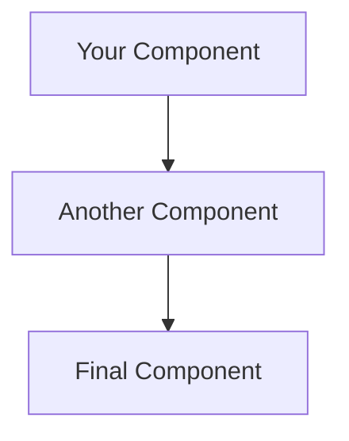

# CyberShield GitHub Pages Documentation

This directory contains the complete GitHub Pages documentation site for the CyberShield AI platform.

## 📁 Documentation Structure

```
docs/
├── _config.yml              # GitHub Pages configuration
├── _layouts/
│   └── default.html         # Custom HTML layout with navigation
├── index.md                 # Homepage
├── architecture.md          # System architecture diagrams
├── aws-infrastructure.md    # AWS deployment architecture
├── api-docs.md             # Complete API documentation
├── deployment.md           # Deployment guide
├── testing.md              # Testing strategy
└── README.md               # This file
```

## 🚀 Quick Setup

### 1. GitHub Repository Setup

1. Push your CyberShield code to GitHub:
   ```bash
   git add docs/
   git commit -m "Add comprehensive GitHub Pages documentation"
   git push origin main
   ```

2. Enable GitHub Pages:
   - Go to your repository on GitHub
   - Navigate to **Settings** > **Pages**
   - Under "Source", select "Deploy from a branch"
   - Choose "main" branch and "/docs" folder
   - Click "Save"

3. Your site will be available at:
   ```
   https://chintamanil.github.io/cybershield
   ```

### 2. Custom Domain (Optional)

If you want to use a custom domain like `cybershield-docs.com`:

1. Add a `CNAME` file to the `docs/` directory:
   ```bash
   echo "cybershield-docs.com" > docs/CNAME
   ```

2. Configure your domain's DNS:
   - Add CNAME record: `www` → `chintamanil.github.io`
   - Add A records for apex domain:
     ```
     185.199.108.153
     185.199.109.153
     185.199.110.153
     185.199.111.153
     ```

3. Enable HTTPS in GitHub Pages settings

## 🎨 Features

### Advanced Documentation Features

- **📊 Interactive Diagrams**: Mermaid.js integration for architecture diagrams
- **🎯 Navigation**: Sticky navigation bar with all major sections
- **📱 Responsive Design**: Works on desktop, tablet, and mobile
- **🔍 SEO Optimized**: Meta tags, Open Graph, and Twitter cards
- **📋 Copy Buttons**: One-click copying for code blocks
- **🎨 Professional Styling**: Clean, modern design with GitHub's design system

### Content Highlights

1. **🏗️ Architecture Page**:
   - Complete system architecture with interactive diagrams
   - Component-by-component breakdowns
   - Performance optimization details
   - Apple Silicon M4 optimization coverage

2. **☁️ AWS Infrastructure**:
   - Detailed AWS deployment architecture
   - Cost optimization strategies  
   - Security configurations
   - Multi-architecture container support

3. **📚 API Documentation**:
   - Complete endpoint reference
   - Request/response examples
   - Error handling documentation
   - Rate limiting and security

4. **🚀 Deployment Guide**:
   - Local development setup
   - AWS production deployment
   - CI/CD pipeline configuration
   - Troubleshooting guides

5. **🧪 Testing Strategy**:
   - 115 test comprehensive coverage
   - Agent testing frameworks
   - Performance benchmarks
   - Integration testing scenarios

## 🛠️ Customization

### Updating Content

1. **Edit existing pages**: Modify any `.md` file in the `docs/` directory
2. **Add new pages**: Create new `.md` files and update navigation in `_layouts/default.html`
3. **Update configuration**: Modify `_config.yml` for site-wide changes

### Styling Customization

The custom CSS is embedded in `_layouts/default.html`. Key style classes:

- `.highlight-box` - Featured content boxes
- `.status-badge` - Status indicators (live, beta, dev)
- `.architecture-grid` - Component grid layouts
- `.metric-card` - Performance metric displays
- `.nav-item` - Navigation cards

### Adding New Diagrams

Use Mermaid.js syntax in markdown:

```markdown

```

## 📊 Analytics (Optional)

To add Google Analytics:

1. Uncomment and update the analytics ID in `_config.yml`:
   ```yaml
   google_analytics: UA-XXXXXXXX-X
   ```

2. The tracking code is automatically included in the layout

## 🔧 Advanced Configuration

### Custom Domains with SSL

For production documentation sites:

1. **Purchase domain** (e.g., from Namecheap, GoDaddy)
2. **Configure DNS** as shown above
3. **Add CNAME file** to docs directory
4. **Enable HTTPS** in GitHub Pages settings (automatic with custom domains)

### Performance Optimization

The site is already optimized with:
- **Font preloading** for faster text rendering
- **CSS minification** through GitHub Pages
- **Image optimization** recommendations in comments
- **Mermaid.js CDN** for diagram rendering

## 🚀 Going Live

Once pushed to GitHub and Pages is enabled:

1. **Automatic deployment** happens within 5-10 minutes
2. **Access your site** at `https://chintamanil.github.io/cybershield`
3. **Share the link** with your team or community
4. **Monitor analytics** (if enabled) to track usage

## 📈 Maintenance

### Regular Updates

- **Keep content current** with code changes
- **Update performance metrics** as system improves  
- **Add new features** to API documentation
- **Update deployment guides** with new AWS features

### Monitoring

GitHub Pages provides basic analytics in repository **Insights > Traffic**.

For advanced analytics:
- Google Analytics integration
- GitHub's traffic insights
- Custom tracking via JavaScript

---

Your comprehensive CyberShield documentation site is now ready to showcase your advanced AI cybersecurity platform to the world! 🛡️