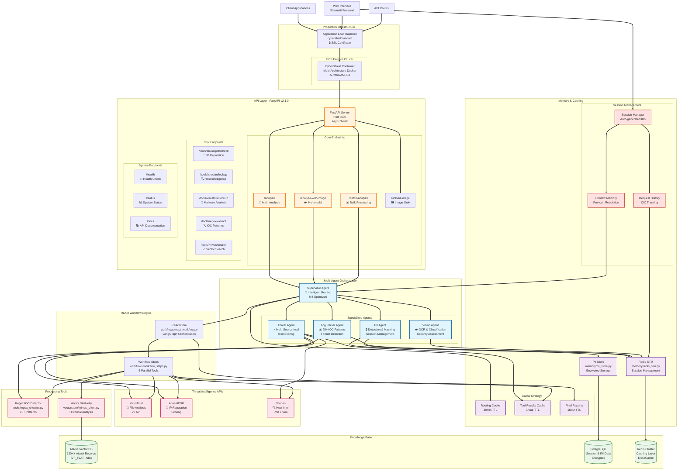
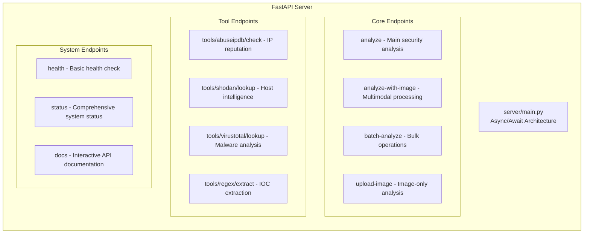
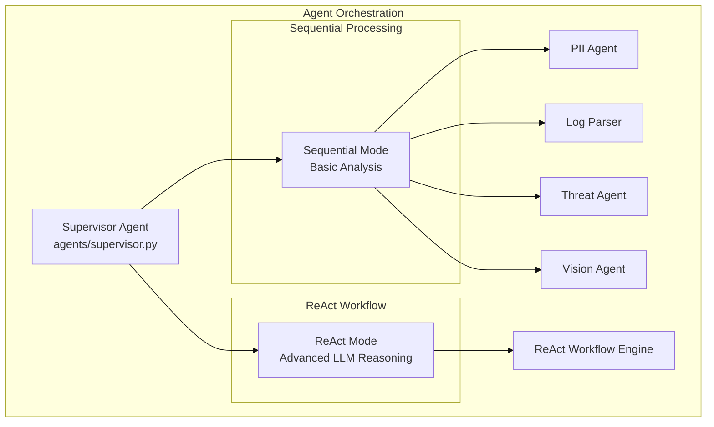
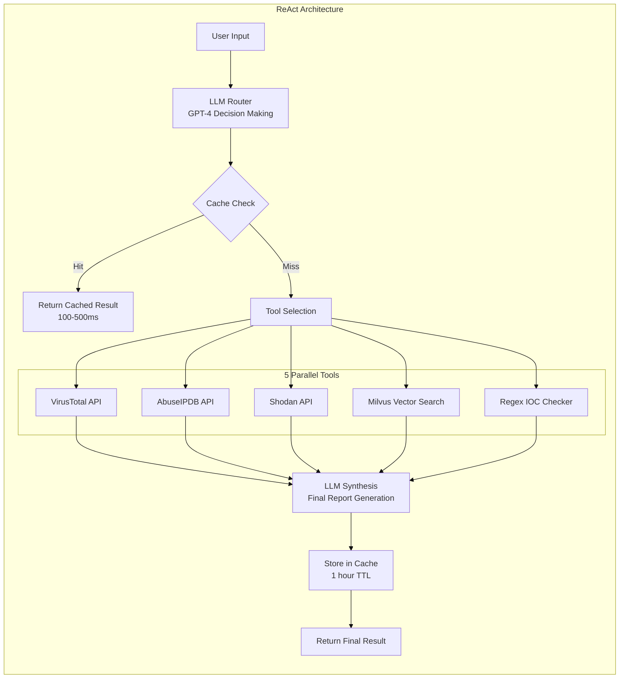
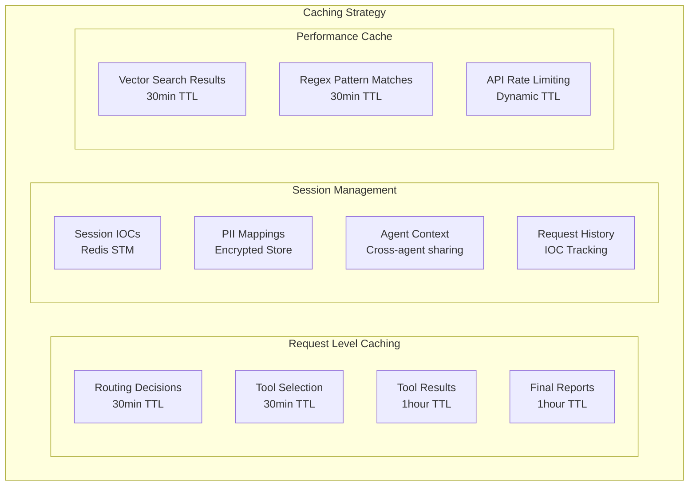
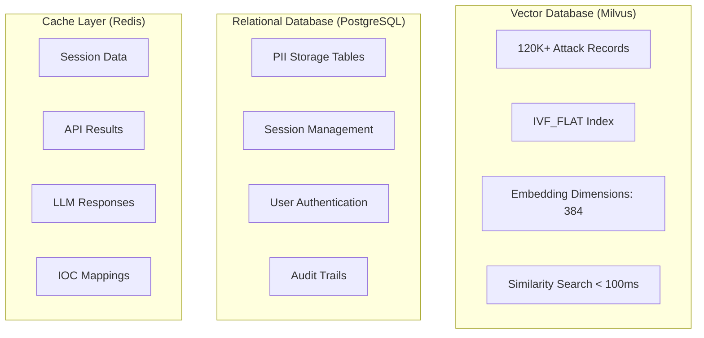
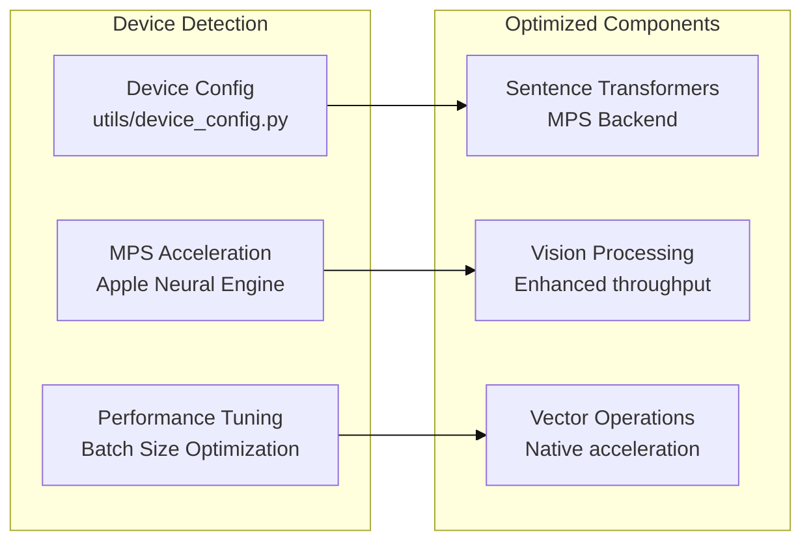
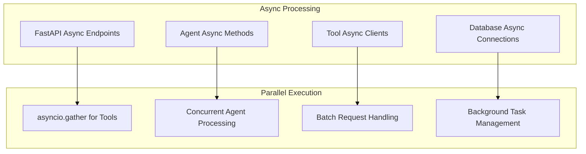
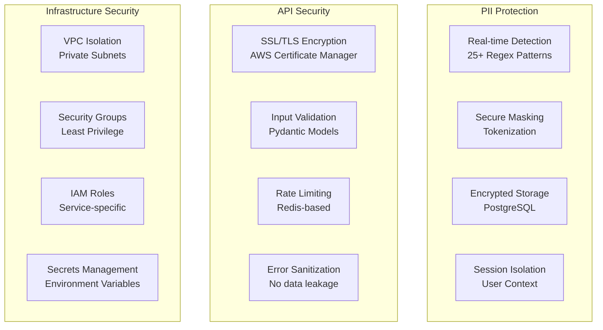
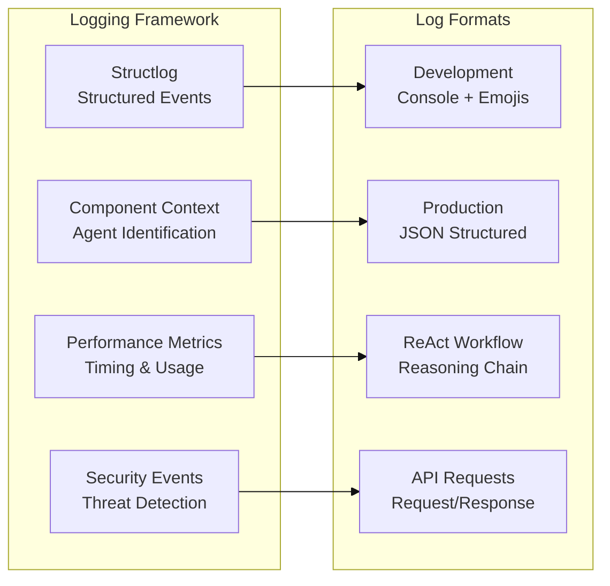

# 🏗️ System Architecture

## Complete CyberShield Architecture Overview

CyberShield implements a sophisticated **multimodal multi-agent AI architecture** that orchestrates five specialized agents through an intelligent supervisor system. The platform seamlessly processes both textual and visual security data using **LLM-driven routing** (OpenAI GPT-4), **computer vision** (Tesseract OCR + OpenCV), and **comprehensive threat intelligence integration** across multiple external APIs.

### 🎯 **Core Architecture Principles**

**Multimodal Processing Pipeline:**
- **Text Analysis**: Advanced IOC extraction, log parsing, and threat correlation
- **Vision Processing**: OCR text extraction, image classification, and visual security assessment
- **Hybrid Intelligence**: Combined text+image analysis for comprehensive security evaluation

**Multi-Agent Orchestration:**
- **Supervisor Agent**: LLM-powered intelligent routing and workflow coordination
- **5 Specialized Agents**: PII detection, threat analysis, log parsing, vision processing, and ReAct workflow execution
- **Dynamic Processing Modes**: Sequential (basic) and ReAct (advanced reasoning) with automatic mode selection

**Intelligence Layer Integration:**
- **External APIs**: VirusTotal, Shodan, AbuseIPDB for real-time threat intelligence
- **Vector Database**: 120,000+ historical attack records for similarity-based pattern matching
- **LLM Reasoning**: GPT-4 powered decision making with context-aware tool selection
- **Comprehensive Caching**: Redis-based multi-level caching achieving 60-80% API cost reduction

**Performance & Security:**
- **Sub-second Responses**: 100-500ms cached responses vs 3-10s fresh analysis
- **Apple Silicon Optimization**: Enhanced performance on Mac M4 architecture
- **Enterprise Security**: PII protection, encrypted storage, audit trails, and production SSL
- **Scalable Infrastructure**: AWS ECS Fargate with auto-scaling and load balancing

---

## 🎯 **Core Architecture Diagram**


```mermaid
graph TD
    %% Client Interfaces
    Client[Client Applications]
    WebUI[Web Interface<br/>Streamlit Frontend]
    API[API Clients]

    %% Load Balancer & SSL
    subgraph "Production Infrastructure"
        ALB[Application Load Balancer<br/>cybershield-ai.com<br/>🔒 SSL Certificate]

        subgraph "ECS Fargate Cluster"
            CONTAINER[CyberShield Container<br/>Multi-Architecture Docker<br/>ARM64/AMD64]
        end
    end

    %% API Layer
    subgraph "API Layer - FastAPI v2.1.0"
        FastAPI[FastAPI Server<br/>Port 8000<br/>Async/Await]

        %% Core Analysis Endpoints
        subgraph "Core Endpoints"
            AnalyzeEP["/analyze<br/>🎯 Main Analysis"]
            ImageEP["/analyze-with-image<br/>👁️ Multimodal"]
            BatchEP["/batch-analyze<br/>📊 Bulk Processing"]
            UploadEP["/upload-image<br/>🖼️ Image Only"]
        end

        %% Tool-Specific Endpoints
        subgraph "Tool Endpoints"
            AbuseEP["/tools/abuseipdb/check<br/>🚨 IP Reputation"]
            ShodanEP["/tools/shodan/lookup<br/>🔍 Host Intelligence"]
            VTEP["/tools/virustotal/lookup<br/>🦠 Malware Analysis"]
            RegexEP["/tools/regex/extract<br/>🔤 IOC Patterns"]
            MilvusEP["/tools/milvus/search<br/>📈 Vector Search"]
        end

        %% System Endpoints
        subgraph "System Endpoints"
            HealthEP["/health<br/>💚 Health Check"]
            StatusEP["/status<br/>📊 System Status"]
            DocsEP["/docs<br/>📚 API Documentation"]
        end
    end

    %% Multi-Agent System
    subgraph "Multi-Agent Orchestration"
        Supervisor[Supervisor Agent<br/>🎯 Intelligent Routing<br/>M4 Optimized]

        subgraph "Specialized Agents"
            PIIAgent[PII Agent<br/>🔒 Detection & Masking<br/>Session Management]
            ThreatAgent[Threat Agent<br/>⚡ Multi-Source Intel<br/>Risk Scoring]
            LogAgent[Log Parser Agent<br/>📊 25+ IOC Patterns<br/>Format Detection]
            VisionAgent[Vision Agent<br/>👁️ OCR & Classification<br/>Security Assessment]
        end
    end

    %% Workflow Engine
    subgraph "ReAct Workflow Engine"
        ReactCore[ReAct Core<br/>workflows/react_workflow.py<br/>LangGraph Orchestration]
        WorkflowSteps[Workflow Steps<br/>workflows/workflow_steps.py<br/>5 Parallel Tools]
    end

    %% Memory and Caching Layer
    subgraph "Memory & Caching"
        RedisSTM[Redis STM<br/>memory/redis_stm.py<br/>Session Management]
        PIIStore[PII Store<br/>memory/pii_store.py<br/>Encrypted Storage]

        subgraph "Cache Strategy"
            RoutingCache[Routing Cache<br/>30min TTL]
            ToolCache[Tool Results Cache<br/>1hour TTL]
            ReportCache[Final Reports<br/>1hour TTL]
        end

        subgraph "Session Management"
            SessionMgr[Session Manager<br/>Auto-generated IDs]
            ReqHistory[Request History<br/>IOC Tracking]
            ContextMem[Context Memory<br/>Pronoun Resolution]
        end
    end

    %% Vector Database
    subgraph "Knowledge Base"
        MilvusDB[(Milvus Vector DB<br/>120K+ Attack Records<br/>IVF_FLAT Index)]
        PostgresDB[(PostgreSQL<br/>Session & PII Data<br/>Encrypted)]
        RedisCluster[(Redis Cluster<br/>Caching Layer<br/>ElastiCache)]
    end

    %% Security Tools Integration (Reduced Width)
    subgraph "Threat Intelligence APIs"
        VirusTotal[VirusTotal<br/>🦠 File Analysis<br/>v3 API]
        AbuseIPDB[AbuseIPDB<br/>🚨 IP Reputation<br/>Scoring]
        Shodan[Shodan<br/>🔍 Host Intel<br/>Port Enum]
    end

    %% Enhanced Processing Tools
    subgraph "Processing Tools"
        RegexChecker[Regex IOC Detector<br/>tools/regex_checker.py<br/>25+ Patterns]
        MilvusSearch[Vector Similarity<br/>vectorstore/milvus_client.py<br/>Historical Analysis]
    end

    %% Data Flow Connections
    Client --> ALB
    WebUI --> ALB
    API --> ALB

    ALB --> CONTAINER
    CONTAINER --> FastAPI

    FastAPI --> AnalyzeEP
    FastAPI --> ImageEP
    FastAPI --> BatchEP
    FastAPI --> UploadEP

    AnalyzeEP --> Supervisor
    ImageEP --> Supervisor
    BatchEP --> Supervisor

    Supervisor --> PIIAgent
    Supervisor --> ThreatAgent
    Supervisor --> LogAgent
    Supervisor --> VisionAgent

    Supervisor --> ReactCore
    ReactCore --> WorkflowSteps

    PIIAgent --> PIIStore
    PIIAgent --> RedisSTM

    ThreatAgent --> VirusTotal
    ThreatAgent --> AbuseIPDB
    ThreatAgent --> Shodan

    LogAgent --> RegexChecker
    LogAgent --> RedisSTM

    VisionAgent --> RedisSTM

    WorkflowSteps --> VirusTotal
    WorkflowSteps --> AbuseIPDB
    WorkflowSteps --> Shodan
    WorkflowSteps --> MilvusSearch
    WorkflowSteps --> RegexChecker

    MilvusSearch --> MilvusDB
    PIIStore --> PostgresDB
    RedisSTM --> RedisCluster

    %% Cache Integration
    Supervisor --> RoutingCache
    ThreatAgent --> ToolCache
    WorkflowSteps --> ToolCache
    ReactCore --> ReportCache

    %% Session Management Integration
    WebUI --> SessionMgr
    SessionMgr --> ReqHistory
    ReqHistory --> RedisSTM
    SessionMgr --> ContextMem
    ContextMem --> Supervisor

    %% Styling
    classDef agentClass fill:#e1f5fe,stroke:#01579b,stroke-width:2px
    classDef cacheClass fill:#f3e5f5,stroke:#4a148c,stroke-width:2px
    classDef dbClass fill:#e8f5e8,stroke:#2e7d32,stroke-width:2px
    classDef apiClass fill:#fff3e0,stroke:#ef6c00,stroke-width:2px
    classDef toolClass fill:#fce4ec,stroke:#c2185b,stroke-width:2px
    classDef sessionClass fill:#ffe0e0,stroke:#c0392b,stroke-width:2px

    class PIIAgent,ThreatAgent,LogAgent,VisionAgent,Supervisor agentClass
    class RedisSTM,PIIStore,RoutingCache,ToolCache,ReportCache cacheClass
    class MilvusDB,PostgresDB,RedisCluster dbClass
    class FastAPI,AnalyzeEP,ImageEP,BatchEP apiClass
    class VirusTotal,AbuseIPDB,Shodan,RegexChecker,MilvusSearch toolClass
    class SessionMgr,ReqHistory,ContextMem sessionClass

    %% Darker Arrow Styling
    linkStyle default stroke:#333,stroke-width:3px
```

---

## 🔧 **Component Architecture Details**

### **1. API Layer (FastAPI v2.1.0)**


```mermaid
graph LR
    subgraph "FastAPI Server"
        Main[server/main.py<br/>Async/Await Architecture]

        subgraph "Core Endpoints"
            A1[analyze - Main security analysis]
            A2[analyze-with-image - Multimodal processing]
            A3[batch-analyze - Bulk operations]
            A4[upload-image - Image-only analysis]
        end

        subgraph "Tool Endpoints"
            T1[tools/abuseipdb/check - IP reputation]
            T2[tools/shodan/lookup - Host intelligence]
            T3[tools/virustotal/lookup - Malware analysis]
            T4[tools/regex/extract - IOC extraction]
        end

        subgraph "System Endpoints"
            S1[health - Basic health check]
            S2[status - Comprehensive system status]
            S3[docs - Interactive API documentation]
        end
    end
```

**Key Features:**
- **Async/Await Architecture**: Non-blocking request handling
- **Comprehensive Error Handling**: Graceful degradation
- **Request Validation**: Pydantic models for data validation
- **Interactive Documentation**: Auto-generated OpenAPI/Swagger docs

### **2. Multi-Agent System**


```mermaid
graph TD
    subgraph "Agent Orchestration"
        SUPER[Supervisor Agent<br/>agents/supervisor.py]

        subgraph "Sequential Processing"
            SEQ[Sequential Mode<br/>Basic Analysis]
        end

        subgraph "ReAct Workflow"
            REACT[ReAct Mode<br/>Advanced LLM Reasoning]
        end

        SUPER --> SEQ
        SUPER --> REACT

        SEQ --> PII[PII Agent]
        SEQ --> LOG[Log Parser]
        SEQ --> THREAT[Threat Agent]
        SEQ --> VISION[Vision Agent]

        REACT --> WORKFLOW[ReAct Workflow Engine]
    end

     %% Darker Arrow Styling
    linkStyle default stroke:#111,stroke-width:1px
```

#### **Agent Specifications:**

| Agent | File | Capabilities | Key Features |
|-------|------|-------------|--------------|
| **Supervisor** | `agents/supervisor.py` | Orchestration, Routing | LLM-driven workflow selection |
| **PII Agent** | `agents/pii_agent.py` | PII Detection, Masking | Session management, secure storage |
| **Threat Agent** | `agents/threat_agent.py` | Multi-source intelligence | Risk scoring, concurrent API calls |
| **Log Parser** | `agents/log_parser.py` | IOC Extraction | 25+ patterns, format detection |
| **Vision Agent** | `agents/vision_agent.py` | OCR, Classification | Image security assessment |

### **3. ReAct Workflow Engine**


```mermaid
graph LR
    subgraph "ReAct Architecture"
        Input[User Input] --> Router[LLM Router<br/>GPT-4 Decision Making]
        Router --> Cache{Cache Check}

        Cache -->|Hit| CachedResult[Return Cached Result<br/>100-500ms]
        Cache -->|Miss| Tools[Tool Selection]

        subgraph "5 Parallel Tools"
            T1[VirusTotal API]
            T2[AbuseIPDB API]
            T3[Shodan API]
            T4[Milvus Vector Search]
            T5[Regex IOC Checker]
        end

        Tools --> T1
        Tools --> T2
        Tools --> T3
        Tools --> T4
        Tools --> T5

        T1 --> Synthesis[LLM Synthesis<br/>Final Report Generation]
        T2 --> Synthesis
        T3 --> Synthesis
        T4 --> Synthesis
        T5 --> Synthesis

        Synthesis --> CacheStore[Store in Cache<br/>1 hour TTL]
        CacheStore --> FinalResult[Return Final Result]
    end

     %% Darker Arrow Styling
    linkStyle default stroke:#111,stroke-width:1px
```

**Performance Optimizations:**
- **60-80% API Cost Reduction** through intelligent caching
- **Sub-second Responses** for cached queries
- **Parallel Tool Execution** with asyncio.gather
- **Smart Cache Keys** using MD5 hashing for consistency

### **4. Memory & Caching Architecture**


```mermaid
graph TD
    subgraph "Caching Strategy"
        subgraph "Request Level Caching"
            RC1[Routing Decisions<br/>30min TTL]
            RC2[Tool Selection<br/>30min TTL]
            RC3[Tool Results<br/>1hour TTL]
            RC4[Final Reports<br/>1hour TTL]
        end

        subgraph "Session Management"
            SM1[Session IOCs<br/>Redis STM]
            SM2[PII Mappings<br/>Encrypted Store]
            SM3[Agent Context<br/>Cross-agent sharing]
            SM4[Request History<br/>IOC Tracking]
        end

        subgraph "Performance Cache"
            PC1[Vector Search Results<br/>30min TTL]
            PC2[Regex Pattern Matches<br/>30min TTL]
            PC3[API Rate Limiting<br/>Dynamic TTL]
        end
    end

     %% Darker Arrow Styling
    linkStyle default stroke:#111,stroke-width:1px
```

**Cache Implementation:**
```python
# Example cache key generation
cache_key = f"cybershield:routing_decision:{md5_hash}"
ttl_mapping = {
    "routing": 1800,      # 30 minutes
    "tool_results": 3600, # 1 hour
    "final_reports": 3600 # 1 hour
}
```

#### **Session Management & Context Memory**

CyberShield implements intelligent **context continuation** through automatic session management:

**Key Features:**
- **Auto-Generated Sessions**: System creates unique session IDs automatically (no user input needed)
- **IOC Tracking**: Extracts and stores IOCs from each analysis for future reference
- **Pronoun Resolution**: Backend resolves references like "that IP", "previous domain", "same hash"
- **Visual Context**: Frontend displays previous query summary and IOC preview
- **Instant UI Updates**: Checkbox appears immediately after first analysis using `st.rerun()`
- **Flexible Workflow**: Easy to continue investigation or start fresh

**Session Flow:**
```python
# 1. First Query - System auto-generates session
session_id = f"session-{uuid.uuid4().hex[:8]}"
st.session_state.auto_session_id = session_id

# 2. Extract and store IOCs
iocs_found = extract_iocs_from_result(result)
save_request_to_history(session_id, text_input, iocs_found)

# 3. Display context continuation checkbox
if use_previous_context:
    # Continue with same session
    return prev_session_id
else:
    # Start new session
    return None
```

**Implementation Files:**
- `frontend/components/session_components.py` - UI components for session management
- `memory/redis_stm.py` - Redis short-term memory for session data
- `frontend/streamlit_app.py` - Session integration and UI refresh logic

### **5. Data Architecture**


```mermaid
graph TD
    subgraph "Vector Database (Milvus)"
        V1[120K+ Attack Records]
        V2[IVF_FLAT Index]
        V3[Embedding Dimensions: 384]
        V4[Similarity Search < 100ms]
    end

    subgraph "Relational Database (PostgreSQL)"
        R1[PII Storage Tables]
        R2[Session Management]
        R3[User Authentication]
        R4[Audit Trails]
    end

    subgraph "Cache Layer (Redis)"
        C1[Session Data]
        C2[API Results]
        C3[LLM Responses]
        C4[IOC Mappings]
    end

     %% Darker Arrow Styling
    linkStyle default stroke:#111,stroke-width:1px
```

### **6. RAG Evaluation Framework**

```mermaid
graph TD
    subgraph "Evaluation Pipeline"
        GD[Golden Dataset<br/>113 queries<br/>9 categories]

        subgraph "Query Processing"
            QP[Query Parser<br/>NLP metadata extraction]
            HYB[Hybrid Search<br/>Attribute + Vector]
        end

        subgraph "Search Strategies"
            ATT[Attribute Filtering<br/>Exact match queries]
            VEC[Vector Similarity<br/>Semantic queries]
        end

        subgraph "Optimizations"
            OPT1[Over-fetching<br/>Fetch 3x, return top-k]
            OPT2[Adaptive nprobe<br/>Dynamic based on size]
            OPT3[Similarity Threshold<br/>Min 0.3 quality gate]
        end
    end

    subgraph "Metrics Calculation"
        MET1[Recall@k<br/>Coverage metric]
        MET2[Precision@k<br/>Accuracy metric]
        MET3[MRR<br/>First hit ranking]
        MET4[NDCG@k<br/>Ranking quality]
        MET5[F1@k<br/>Balance metric]
    end

    subgraph "Results & Reporting"
        AGG[Aggregate Metrics<br/>Overall performance]
        CAT[Per-Category Metrics<br/>9 category breakdown]
        REP[HTML/JSON Reports<br/>Interactive visualization]
        QG[Quality Gates<br/>Deployment thresholds]
    end

    GD --> QP
    QP --> HYB
    HYB --> ATT
    HYB --> VEC

    ATT --> OPT1
    VEC --> OPT1
    OPT1 --> OPT2
    OPT2 --> OPT3

    OPT3 --> MET1
    OPT3 --> MET2
    OPT3 --> MET3
    OPT3 --> MET4
    OPT3 --> MET5

    MET1 --> AGG
    MET2 --> AGG
    MET3 --> AGG
    MET4 --> AGG
    MET5 --> AGG

    AGG --> CAT
    CAT --> REP
    REP --> QG

    %% Darker Arrow Styling
    linkStyle default stroke:#111,stroke-width:1px
```

**Evaluation Results (October 2025):**

| Metric | Value | Interpretation |
|--------|-------|----------------|
| **MRR** | 1.000 | ✅ Perfect ranking (first result always relevant) |
| **Recall@5** | 0.565 | ⚠️ Moderate (56.5% of relevant docs retrieved) |
| **Precision@5** | 0.720 | ✅ Good (72% of results are relevant) |
| **F1@5** | 0.397 | ⚠️ Moderate (balance could improve) |
| **NDCG@5** | 1.000 | ✅ Excellent ranking quality |
| **Category Coverage** | 9/9 | ✅ 100% categories with meaningful metrics |

**Key Features:**
- **Hybrid Search**: Combines attribute filtering for exact matches with vector similarity for semantic queries
- **Natural Language Parsing**: Extracts metadata from queries like "Show High Intrusion incidents"
- **3 Optimizations**: Over-fetching (3x candidates), adaptive nprobe (dynamic based on collection size), similarity threshold (min 0.3)
- **Complete Coverage**: All 9 categories (ip_reputation, geo_location, port_scan, combined, severity, malware_ioc, attack_type, protocol, attack_signature) show non-zero metrics

**Implementation Files:**
- `evaluation/harness/eval_harness.py` - Main evaluation harness with hybrid search
- `vectorstore/milvus_client.py` - Optimized vector search with 3 enhancements
- `evaluation/BASELINE_NOTES.md` - Comprehensive metric explanations
- `evaluation/SEMANTIC_QUERY_ANALYSIS.md` - Real-world semantic query analysis

---

## ⚡ **Performance Architecture**

### **Apple Silicon Optimization (Mac M4)**


```mermaid
graph LR
    subgraph "Device Detection"
        D1[Device Config<br/>utils/device_config.py]
        D2[MPS Acceleration<br/>Apple Neural Engine]
        D3[Performance Tuning<br/>Batch Size Optimization]
    end

    subgraph "Optimized Components"
        O1[Sentence Transformers<br/>MPS Backend]
        O2[Vision Processing<br/>Enhanced throughput]
        O3[Vector Operations<br/>Native acceleration]
    end

    D1 --> O1
    D2 --> O2
    D3 --> O3

     %% Darker Arrow Styling
    linkStyle default stroke:#111,stroke-width:1px
```

**Key Optimizations:**
- **MPS Acceleration**: Metal Performance Shaders for AI operations
- **Batch Size Tuning**: Optimized for Apple Silicon memory architecture
- **Native Integration**: Seamless CPU/GPU coordination

### **Concurrent Processing Architecture**


```mermaid
graph TD
    subgraph "Async Processing"
        A1[FastAPI Async Endpoints]
        A2[Agent Async Methods]
        A3[Tool Async Clients]
        A4[Database Async Connections]
    end

    subgraph "Parallel Execution"
        P1[asyncio.gather for Tools]
        P2[Concurrent Agent Processing]
        P3[Batch Request Handling]
        P4[Background Task Management]
    end

    A1 --> P1
    A2 --> P2
    A3 --> P3
    A4 --> P4

     %% Darker Arrow Styling
    linkStyle default stroke:#111,stroke-width:1px
```

---

## 🔒 **Security Architecture**

### **Data Protection**


```mermaid
graph TD
    subgraph "PII Protection"
        PII1[Real-time Detection<br/>25+ Regex Patterns]
        PII2[Secure Masking<br/>Tokenization]
        PII3[Encrypted Storage<br/>PostgreSQL]
        PII4[Session Isolation<br/>User Context]
    end

    subgraph "API Security"
        API1[SSL/TLS Encryption<br/>AWS Certificate Manager]
        API2[Input Validation<br/>Pydantic Models]
        API3[Rate Limiting<br/>Redis-based]
        API4[Error Sanitization<br/>No data leakage]
    end

    subgraph "Infrastructure Security"
        INF1[VPC Isolation<br/>Private Subnets]
        INF2[Security Groups<br/>Least Privilege]
        INF3[IAM Roles<br/>Service-specific]
        INF4[Secrets Management<br/>Environment Variables]
    end

     %% Darker Arrow Styling
    linkStyle default stroke:#111,stroke-width:1px
```

---

## 📊 **Monitoring & Observability**

### **Structured Logging Architecture**


```mermaid
graph LR
    subgraph "Logging Framework"
        L1[Structlog<br/>Structured Events]
        L2[Component Context<br/>Agent Identification]
        L3[Performance Metrics<br/>Timing & Usage]
        L4[Security Events<br/>Threat Detection]
    end

    subgraph "Log Formats"
        F1[Development<br/>Console + Emojis]
        F2[Production<br/>JSON Structured]
        F3[ReAct Workflow<br/>Reasoning Chain]
        F4[API Requests<br/>Request/Response]
    end

    L1 --> F1
    L2 --> F2
    L3 --> F3
    L4 --> F4

     %% Darker Arrow Styling
    linkStyle default stroke:#111,stroke-width:1px
```

**Logging Configuration:**
```python
# Environment Variables
LOG_LEVEL=INFO                    # Logging level
LOG_FILE=logs/cybershield.log     # Optional file output
REACT_LOG_FORMAT=json             # JSON format for ReAct workflow
```

---

This comprehensive architecture enables CyberShield to deliver enterprise-grade cybersecurity AI analysis with optimal performance, security, and scalability.