# 🏗️ System Architecture

## Complete CyberShield Architecture Overview

CyberShield implements a sophisticated multi-agent AI architecture with intelligent caching, LLM-driven routing, and comprehensive threat intelligence integration.

---

## 🎯 **Core Architecture Diagram**

```mermaid
graph TD
    %% Client Interfaces
    Client[Client Applications]
    WebUI[Web Interface<br/>Streamlit Frontend]
    API[API Clients]

    %% Load Balancer & SSL
    subgraph "Production Infrastructure"
        ALB[Application Load Balancer<br/>cybershield-ai.com<br/>🔒 SSL Certificate]
        
        subgraph "ECS Fargate Cluster"
            CONTAINER[CyberShield Container<br/>Multi-Architecture Docker<br/>ARM64/AMD64]
        end
    end

    %% API Layer
    subgraph "API Layer - FastAPI v2.1.0"
        FastAPI[FastAPI Server<br/>Port 8000<br/>Async/Await]

        %% Core Analysis Endpoints
        subgraph "Core Endpoints"
            AnalyzeEP["/analyze<br/>🎯 Main Analysis"]
            ImageEP["/analyze-with-image<br/>👁️ Multimodal"]
            BatchEP["/batch-analyze<br/>📊 Bulk Processing"]
            UploadEP["/upload-image<br/>🖼️ Image Only"]
        end

        %% Tool-Specific Endpoints
        subgraph "Tool Endpoints"
            AbuseEP["/tools/abuseipdb/check<br/>🚨 IP Reputation"]
            ShodanEP["/tools/shodan/lookup<br/>🔍 Host Intelligence"]
            VTEP["/tools/virustotal/lookup<br/>🦠 Malware Analysis"]
            RegexEP["/tools/regex/extract<br/>🔤 IOC Patterns"]
            MilvusEP["/tools/milvus/search<br/>📈 Vector Search"]
        end

        %% System Endpoints
        subgraph "System Endpoints"
            HealthEP["/health<br/>💚 Health Check"]
            StatusEP["/status<br/>📊 System Status"]
            DocsEP["/docs<br/>📚 API Documentation"]
        end
    end

    %% Multi-Agent System
    subgraph "Multi-Agent Orchestration"
        Supervisor[Supervisor Agent<br/>🎯 Intelligent Routing<br/>M4 Optimized]

        subgraph "Specialized Agents"
            PIIAgent[PII Agent<br/>🔒 Detection & Masking<br/>Session Management]
            ThreatAgent[Threat Agent<br/>⚡ Multi-Source Intel<br/>Risk Scoring]
            LogAgent[Log Parser Agent<br/>📊 25+ IOC Patterns<br/>Format Detection]
            VisionAgent[Vision Agent<br/>👁️ OCR & Classification<br/>Security Assessment]
        end
    end

    %% Workflow Engine
    subgraph "ReAct Workflow Engine"
        ReactCore[ReAct Core<br/>workflows/react_workflow.py<br/>LangGraph Orchestration]
        WorkflowSteps[Workflow Steps<br/>workflows/workflow_steps.py<br/>5 Parallel Tools]
    end

    %% Memory and Caching Layer
    subgraph "Memory & Caching"
        RedisSTM[Redis STM<br/>memory/redis_stm.py<br/>Session Management]
        PIIStore[PII Store<br/>memory/pii_store.py<br/>Encrypted Storage]
        
        subgraph "Cache Strategy"
            RoutingCache[Routing Cache<br/>30min TTL]
            ToolCache[Tool Results Cache<br/>1hour TTL]
            ReportCache[Final Reports<br/>1hour TTL]
        end
    end

    %% Vector Database
    subgraph "Knowledge Base"
        MilvusDB[(Milvus Vector DB<br/>120K+ Attack Records<br/>IVF_FLAT Index)]
        PostgresDB[(PostgreSQL<br/>Session & PII Data<br/>Encrypted)]
        RedisCluster[(Redis Cluster<br/>Caching Layer<br/>ElastiCache)]
    end

    %% Security Tools Integration
    subgraph "Threat Intelligence APIs"
        VirusTotal[VirusTotal<br/>🦠 File/URL/Domain Analysis<br/>v3 API Integration]
        AbuseIPDB[AbuseIPDB<br/>🚨 IP Reputation<br/>Confidence Scoring]
        Shodan[Shodan<br/>🔍 Host Intelligence<br/>Port & Service Enum]
    end

    %% Enhanced Processing Tools
    subgraph "Processing Tools"
        RegexChecker[Regex IOC Detector<br/>tools/regex_checker.py<br/>25+ Patterns]
        MilvusSearch[Vector Similarity<br/>vectorstore/milvus_client.py<br/>Historical Analysis]
    end

    %% Data Flow Connections
    Client --> ALB
    WebUI --> ALB
    API --> ALB
    
    ALB --> CONTAINER
    CONTAINER --> FastAPI
    
    FastAPI --> AnalyzeEP
    FastAPI --> ImageEP
    FastAPI --> BatchEP
    FastAPI --> UploadEP
    
    AnalyzeEP --> Supervisor
    ImageEP --> Supervisor
    BatchEP --> Supervisor
    
    Supervisor --> PIIAgent
    Supervisor --> ThreatAgent
    Supervisor --> LogAgent
    Supervisor --> VisionAgent
    
    Supervisor --> ReactCore
    ReactCore --> WorkflowSteps
    
    PIIAgent --> PIIStore
    PIIAgent --> RedisSTM
    
    ThreatAgent --> VirusTotal
    ThreatAgent --> AbuseIPDB
    ThreatAgent --> Shodan
    
    LogAgent --> RegexChecker
    LogAgent --> RedisSTM
    
    VisionAgent --> RedisSTM
    
    WorkflowSteps --> VirusTotal
    WorkflowSteps --> AbuseIPDB
    WorkflowSteps --> Shodan
    WorkflowSteps --> MilvusSearch
    WorkflowSteps --> RegexChecker
    
    MilvusSearch --> MilvusDB
    PIIStore --> PostgresDB
    RedisSTM --> RedisCluster
    
    %% Cache Integration
    Supervisor --> RoutingCache
    ThreatAgent --> ToolCache
    WorkflowSteps --> ToolCache
    ReactCore --> ReportCache

    %% Styling
    classDef agentClass fill:#e1f5fe,stroke:#01579b,stroke-width:2px
    classDef cacheClass fill:#f3e5f5,stroke:#4a148c,stroke-width:2px
    classDef dbClass fill:#e8f5e8,stroke:#2e7d32,stroke-width:2px
    classDef apiClass fill:#fff3e0,stroke:#ef6c00,stroke-width:2px
    classDef toolClass fill:#fce4ec,stroke:#c2185b,stroke-width:2px
    
    class PIIAgent,ThreatAgent,LogAgent,VisionAgent,Supervisor agentClass
    class RedisSTM,PIIStore,RoutingCache,ToolCache,ReportCache cacheClass
    class MilvusDB,PostgresDB,RedisCluster dbClass
    class FastAPI,AnalyzeEP,ImageEP,BatchEP apiClass
    class VirusTotal,AbuseIPDB,Shodan,RegexChecker,MilvusSearch toolClass
```



---

## 🔧 **Component Architecture Details**

### **1. API Layer (FastAPI v2.1.0)**


**Key Features:**
- **Async/Await Architecture**: Non-blocking request handling
- **Comprehensive Error Handling**: Graceful degradation
- **Request Validation**: Pydantic models for data validation
- **Interactive Documentation**: Auto-generated OpenAPI/Swagger docs

### **2. Multi-Agent System**


#### **Agent Specifications:**

| Agent | File | Capabilities | Key Features |
|-------|------|-------------|--------------|
| **Supervisor** | `agents/supervisor.py` | Orchestration, Routing | LLM-driven workflow selection |
| **PII Agent** | `agents/pii_agent.py` | PII Detection, Masking | Session management, secure storage |
| **Threat Agent** | `agents/threat_agent.py` | Multi-source intelligence | Risk scoring, concurrent API calls |
| **Log Parser** | `agents/log_parser.py` | IOC Extraction | 25+ patterns, format detection |
| **Vision Agent** | `agents/vision_agent.py` | OCR, Classification | Image security assessment |

### **3. ReAct Workflow Engine**


**Performance Optimizations:**
- **60-80% API Cost Reduction** through intelligent caching
- **Sub-second Responses** for cached queries
- **Parallel Tool Execution** with asyncio.gather
- **Smart Cache Keys** using MD5 hashing for consistency

### **4. Memory & Caching Architecture**


**Cache Implementation:**
```python
# Example cache key generation
cache_key = f"cybershield:routing_decision:{md5_hash}"
ttl_mapping = {
    "routing": 1800,      # 30 minutes
    "tool_results": 3600, # 1 hour
    "final_reports": 3600 # 1 hour
}
```

### **5. Data Architecture**


---

## ⚡ **Performance Architecture**

### **Apple Silicon Optimization (Mac M4)**


**Key Optimizations:**
- **MPS Acceleration**: Metal Performance Shaders for AI operations
- **Batch Size Tuning**: Optimized for Apple Silicon memory architecture
- **Native Integration**: Seamless CPU/GPU coordination

### **Concurrent Processing Architecture**


---

## 🔒 **Security Architecture**

### **Data Protection**


---

## 📊 **Monitoring & Observability**

### **Structured Logging Architecture**


**Logging Configuration:**
```python
# Environment Variables
LOG_LEVEL=INFO                    # Logging level
LOG_FILE=logs/cybershield.log     # Optional file output
REACT_LOG_FORMAT=json             # JSON format for ReAct workflow
```

---

This comprehensive architecture enables CyberShield to deliver enterprise-grade cybersecurity AI analysis with optimal performance, security, and scalability.