# ☁️ AWS Infrastructure

## Production-Grade AWS Deployment Architecture

CyberShield is deployed on AWS using a comprehensive, scalable infrastructure that supports high availability, security, and performance optimization.

---

## 🏗️ **Complete AWS Architecture**

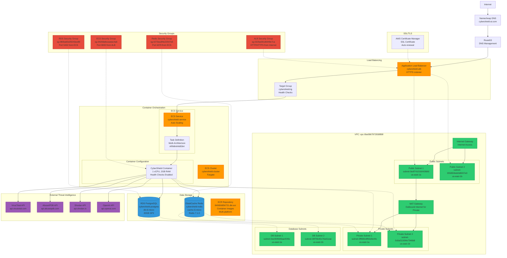

---

## 🌐 **Domain & SSL Configuration**

### **Custom Domain Setup**

| Component | Configuration | Status |
|-----------|---------------|--------|
| **Domain** | cybershield-ai.com | ✅ Active |
| **Registrar** | Namecheap | ✅ Purchased ($11.48/year) |
| **SSL Certificate** | AWS Certificate Manager | ✅ Auto-renewal enabled |
| **DNS Validation** | Route53 integration | ✅ Automated |

### **SSL Certificate Details**

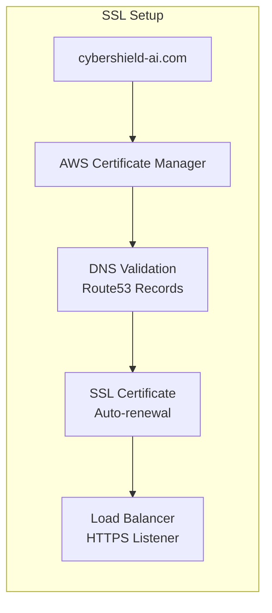

**Certificate Configuration:**
- **Type**: AWS Certificate Manager (ACM)
- **Validation**: DNS validation via Route53
- **Auto-renewal**: Enabled (automatic)
- **Domains**: cybershield-ai.com, *.cybershield-ai.com
- **Security**: TLS 1.2+ enforced

---

## 🐳 **Container Infrastructure**

### **ECS Fargate Configuration**

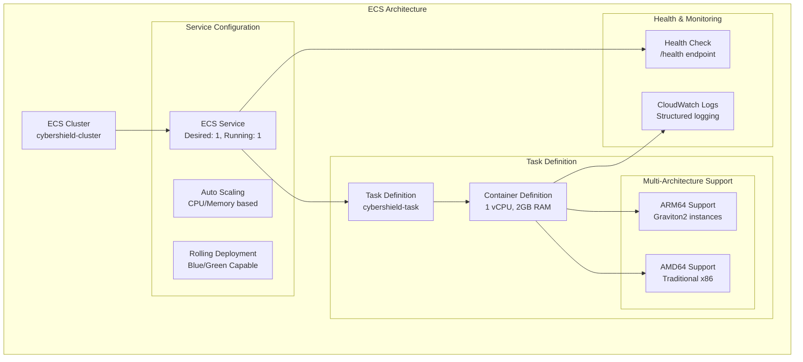

### **Container Specifications**

| Resource | Specification | Rationale |
|----------|---------------|-----------|
| **CPU** | 1 vCPU | Optimized for AI workloads |
| **Memory** | 2048 MB | Supports ML models + caching |
| **Architecture** | ARM64/AMD64 | Multi-platform compatibility |
| **Health Check** | `/health` endpoint | 30s interval, 3 retries |
| **Logging** | CloudWatch Logs | Structured JSON logging |

---

## 🗄️ **Database Architecture**

### **RDS PostgreSQL Configuration**

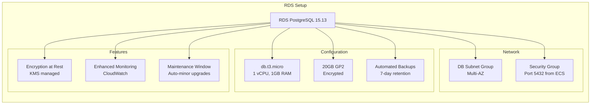

**Database Details:**
- **Engine**: PostgreSQL 15.13
- **Instance**: db.t3.micro (1 vCPU, 1GB RAM)
- **Storage**: 20GB GP2 with encryption
- **Endpoint**: `cybershield-postgres.cwo4lje0wol6.us-east-1.rds.amazonaws.com:5432`
- **Backups**: Automated daily backups, 7-day retention
- **Security**: VPC isolation, encrypted storage

### **ElastiCache Redis Configuration**

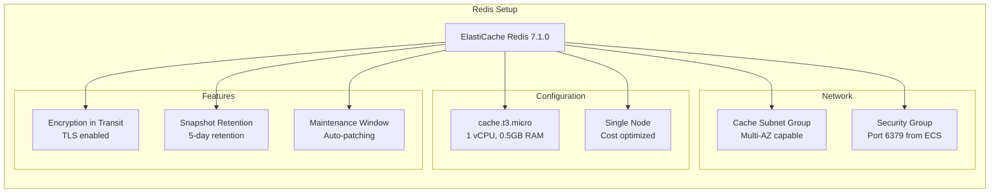

**Cache Details:**
- **Engine**: Redis 7.1.0
- **Instance**: cache.t3.micro (1 vCPU, 0.5GB RAM)
- **Endpoint**: `cybershield-redis.i2louo.0001.use1.cache.amazonaws.com:6379`
- **Security**: VPC isolation, encryption in transit
- **Usage**: Session management, API caching, IOC storage

---

## 🔒 **Security Architecture**

### **Network Security**

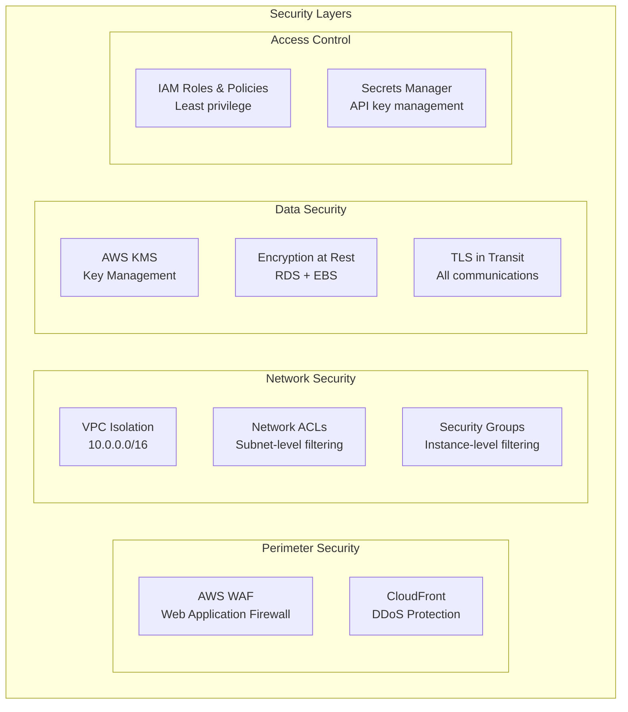

### **Security Group Configuration**

| Security Group | Purpose | Rules |
|----------------|---------|-------|
| **ALB Security Group** | `sg-022ba581db949e7ca` | HTTP (80) from Internet HTTPS (443) from Internet |
| **ECS Security Group** | `sg-04269afeceada14a6` | Port 8000 from ALB only |
| **RDS Security Group** | `sg-080ba65d29243ee89` | Port 5432 from ECS only |
| **Redis Security Group** | `sg-0273ea3f4e22547e5` | Port 6379 from ECS only |

### **IAM Roles & Policies**

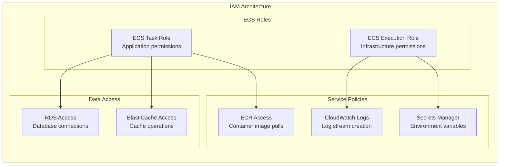

---

## 📈 **Monitoring & Logging**

### **CloudWatch Integration**

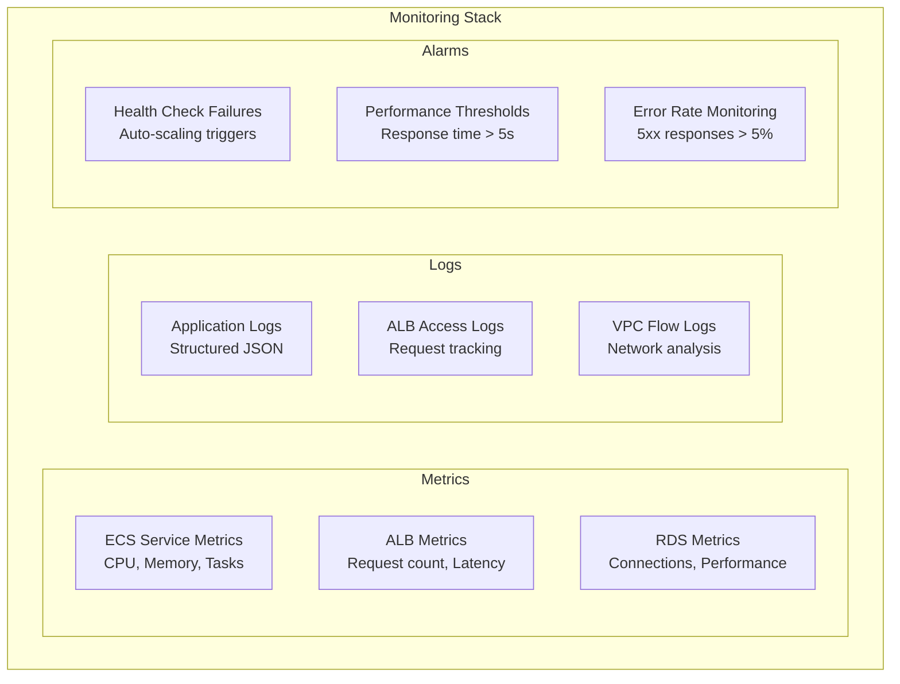

### **Auto Scaling Configuration**

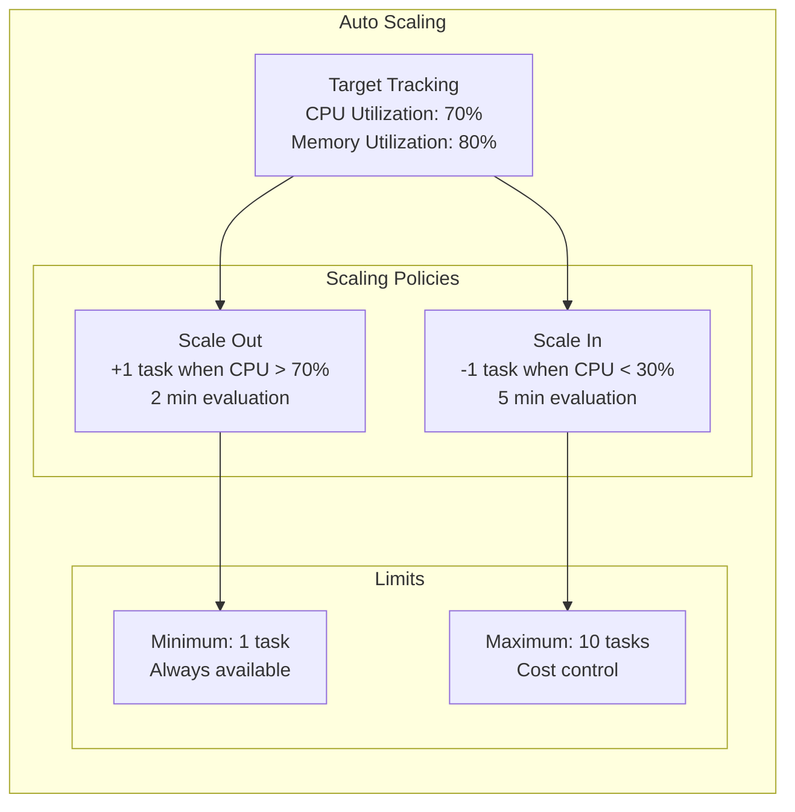

---

## 💰 **Cost Optimization**

### **Current Cost Structure (Monthly)**

| Service | Instance Type | Estimated Cost | Optimization |
|---------|---------------|----------------|--------------|
| **ECS Fargate** | 1 vCPU, 2GB RAM | $20-30 | Spot instances capable |
| **RDS PostgreSQL** | db.t3.micro | $15-20 | Free tier eligible |
| **ElastiCache Redis** | cache.t3.micro | $15-20 | Single node setup |
| **Application Load Balancer** | Standard ALB | $20-25 | Usage-based pricing |
| **Domain Registration** | cybershield-ai.com | $11.48/year | Annual renewal |
| **SSL Certificate** | AWS Certificate Manager | Free | AWS managed |
| **Data Transfer** | Outbound traffic | $5-10 | CDN optimization available |
| **Total Estimated** | - | **$70-95/month** | Production workload |

### **Cost Optimization Strategies**

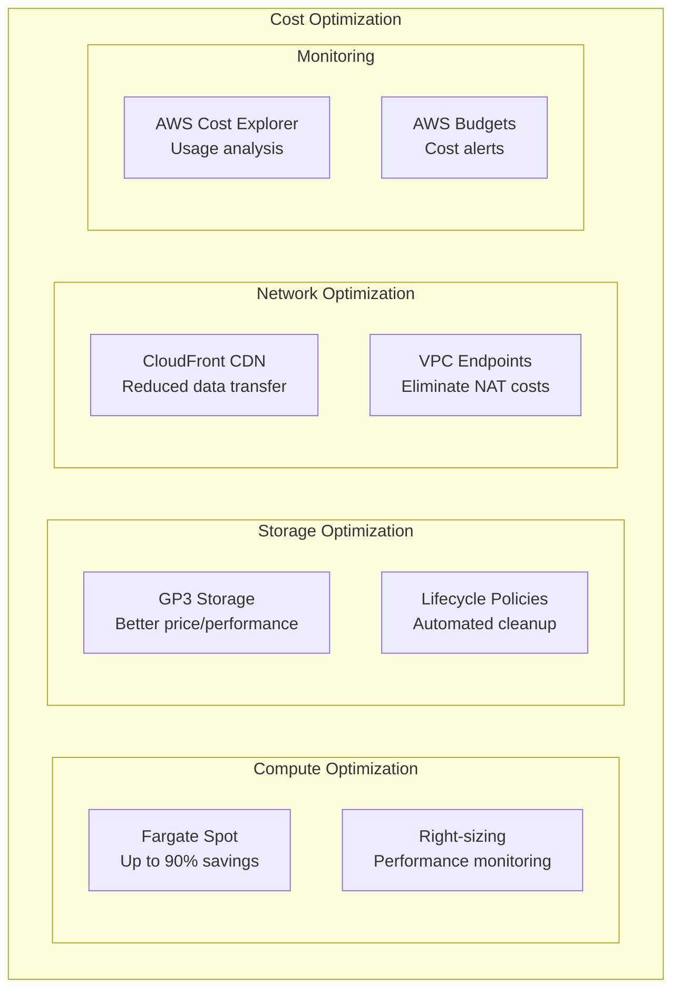

---

## 🚀 **Deployment Process**

### **CI/CD Pipeline Architecture**

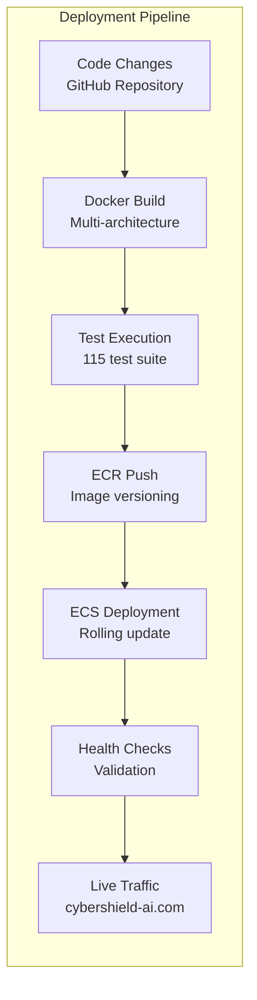

### **Deployment Scripts**

| Script | Purpose | Location |
|--------|---------|----------|
| `aws_setup.sh` | Complete infrastructure setup | `scripts/` |
| `deploy_aws.py` | Application deployment | `scripts/` |
| `setup_ssl_only.sh` | SSL certificate configuration | `scripts/` |
| `fix_api_routing.sh` | Load balancer routing | `scripts/` |
| `update_alb_certificate.sh` | Certificate updates | `scripts/` |

---

## 🔄 **Disaster Recovery**

### **Backup Strategy**

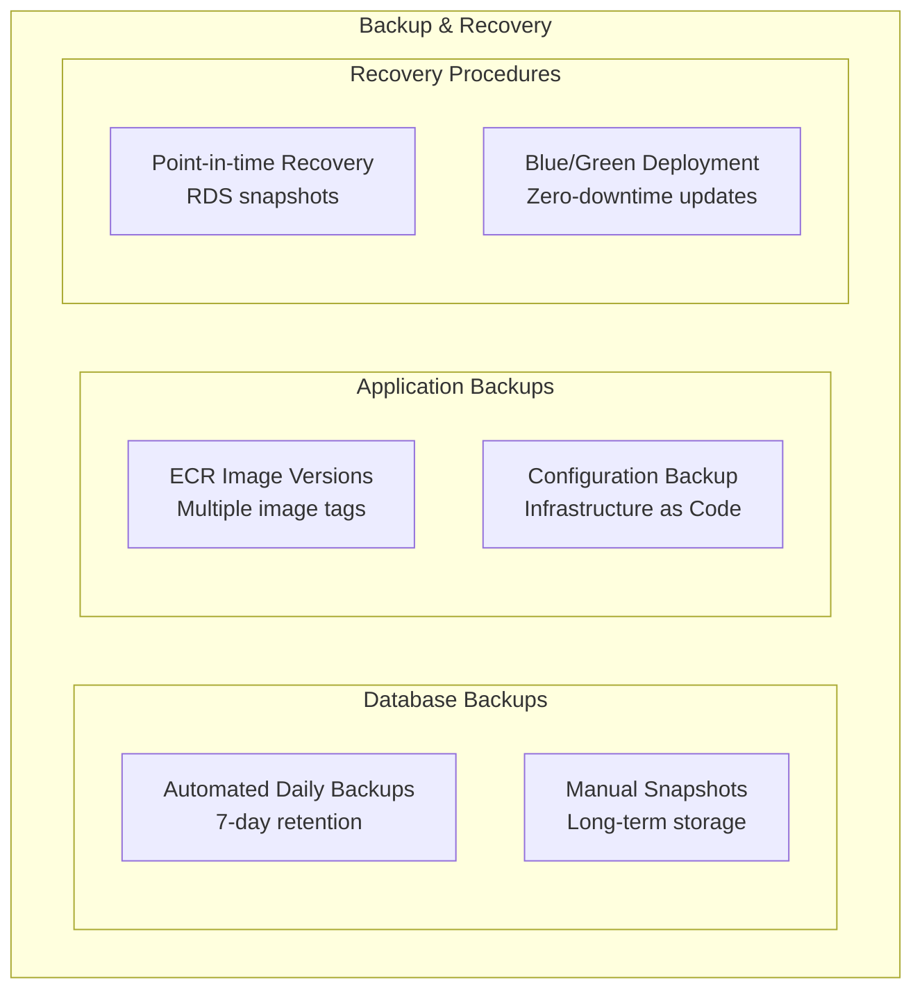

### **High Availability Features**

- **Multi-AZ Deployment**: Database and cache in multiple availability zones
- **Auto Scaling**: Automatic scaling based on demand
- **Health Checks**: Continuous monitoring and automatic replacement
- **Load Balancing**: Traffic distribution across healthy instances
- **Backup & Recovery**: Automated backups with point-in-time recovery

---

This comprehensive AWS infrastructure provides enterprise-grade scalability, security, and reliability for the CyberShield AI platform, with optimized costs and automated management capabilities.