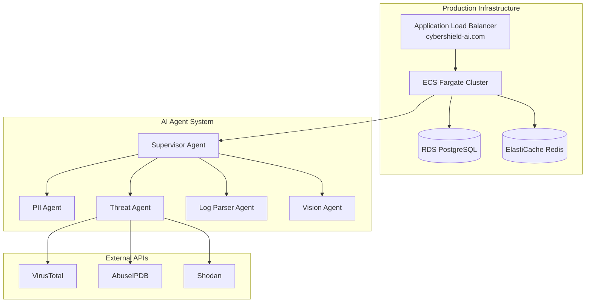

# 🛡️ CyberShield AI Platform

## Advanced Multi-Agent Cybersecurity AI Platform

**CyberShield** is a sophisticated AI-powered cybersecurity platform that combines multiple specialized agents with comprehensive caching and LLM-driven intelligence to provide lightning-fast threat analysis, PII detection, log parsing, and vision-based security assessment.

---

## 🌐 **Production Platform Status**

### **✅ Live at https://cybershield-ai.com**
- **🔒 SSL Secured**: AWS Certificate Manager with auto-renewal
- **⚡ Sub-second Response**: Intelligent caching for instant results
- **🌍 Global Accessibility**: Production-grade infrastructure on AWS
- **🐳 Multi-Architecture**: ARM64/AMD64 Docker support

---

## 🚀 **Key Features**

<div class="feature-grid">
  <div class="feature-card">
    <h3>🧠 LLM-Driven Intelligence</h3>
    <p>OpenAI-powered routing and tool selection with comprehensive caching</p>
  </div>
  
  <div class="feature-card">
    <h3>⚡ Lightning Performance</h3>
    <p>60-80% API cost reduction, 100-500ms cached responses</p>
  </div>
  
  <div class="feature-card">
    <h3>🔧 Multi-Source Intelligence</h3>
    <p>5 parallel tools: VirusTotal, AbuseIPDB, Shodan, MilvusSearch, RegexChecker</p>
  </div>
  
  <div class="feature-card">
    <h3>📊 Historical Analysis</h3>
    <p>120,000+ cybersecurity attack records in Milvus vector database</p>
  </div>
  
  <div class="feature-card">
    <h3>👁️ Vision AI</h3>
    <p>Complete OCR and image security analysis with tesseract integration</p>
  </div>
  
  <div class="feature-card">
    <h3>🎯 Smart Architecture</h3>
    <p>Clean, maintainable codebase with Apple Silicon optimization</p>
  </div>
</div>

---

## 📋 **Quick Start**

### **API Access**
```bash
# Security Analysis
curl -X POST https://cybershield-ai.com/analyze \
  -H "Content-Type: application/json" \
  -d '{"text": "Suspicious IP 203.0.113.1 detected"}'

# Health Check
curl https://cybershield-ai.com/health

# System Status
curl https://cybershield-ai.com/status
```

### **Web Interface**
- **Frontend**: [https://cybershield-ai.com](https://cybershield-ai.com) (Streamlit UI)
- **API Docs**: [https://cybershield-ai.com/docs](https://cybershield-ai.com/docs)

---

## 🏗️ **Architecture Overview**



---

## 📊 **Performance Metrics**

| Metric | Value | Description |
|--------|-------|-------------|
| **Response Time** | 100-500ms | Cached responses |
| **API Cost Reduction** | 60-80% | Through intelligent caching |
| **Test Coverage** | 115 tests | Comprehensive validation |
| **IOC Patterns** | 25+ types | Advanced pattern recognition |
| **Vector Database** | 120K records | Historical attack analysis |

---

## 🔗 **Navigation**

<div class="nav-grid">
  <a href="/architecture" class="nav-card">
    <h3>🏗️ Architecture</h3>
    <p>Detailed system architecture and component diagrams</p>
  </a>
  
  <a href="/aws-infrastructure" class="nav-card">
    <h3>☁️ AWS Infrastructure</h3>
    <p>Complete AWS deployment and infrastructure setup</p>
  </a>
  
  <a href="/api-docs" class="nav-card">
    <h3>📚 API Documentation</h3>
    <p>Comprehensive API reference and examples</p>
  </a>
  
  <a href="/deployment" class="nav-card">
    <h3>🚀 Deployment Guide</h3>
    <p>Step-by-step deployment instructions</p>
  </a>
  
  <a href="/testing" class="nav-card">
    <h3>🧪 Testing</h3>
    <p>Test coverage and validation strategies</p>
  </a>
</div>

---

## 📈 **Latest Updates (August 2025)**

- **🌐 Custom Domain**: cybershield-ai.com with SSL certificate
- **🔒 Production SSL**: AWS Certificate Manager with auto-renewal
- **⚖️ Load Balancer**: Optimized ALB routing for frontend/backend separation
- **🐳 Multi-Architecture**: ARM64/AMD64 Docker support
- **📁 Clean Architecture**: 57% scripts reduction, essential components only
- **⚡ Apple Silicon**: Mac M4 optimized performance enhancements

---

<style>
.feature-grid, .nav-grid {
  display: grid;
  grid-template-columns: repeat(auto-fit, minmax(300px, 1fr));
  gap: 20px;
  margin: 20px 0;
}

.feature-card, .nav-card {
  border: 1px solid #e1e4e8;
  border-radius: 8px;
  padding: 20px;
  background: #f6f8fa;
  text-decoration: none;
  color: inherit;
  transition: transform 0.2s, box-shadow 0.2s;
}

.feature-card:hover, .nav-card:hover {
  transform: translateY(-2px);
  box-shadow: 0 4px 12px rgba(0,0,0,0.1);
}

.feature-card h3, .nav-card h3 {
  margin-top: 0;
  color: #0366d6;
}

.feature-card p, .nav-card p {
  margin-bottom: 0;
  color: #586069;
}
</style>