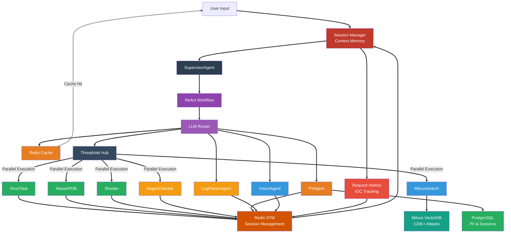

# 🛡️ CyberShield AI Platform

## Multimodal Multi-Agent Cybersecurity AI Platform

**CyberShield** is a cutting-edge multimodal AI cybersecurity platform that orchestrates five specialized agents through a sophisticated supervisor system. The platform processes both text and visual inputs, leveraging LLM-driven intelligence (OpenAI GPT-4), computer vision (OCR with Tesseract), and multiple threat intelligence APIs (VirusTotal, Shodan, AbuseIPDB). With comprehensive Redis caching, vector similarity search on 120K+ historical attacks, and ReAct workflow orchestration via LangGraph, CyberShield delivers sub-second threat analysis, PII detection, advanced log parsing, and vision-based security assessment across diverse data modalities.


---

## 🚀 **Key Features**

<div class="feature-grid">
  <div class="feature-card">
    <h3>🧠 LLM-Driven Intelligence</h3>
    <p>OpenAI-powered routing and tool selection with comprehensive caching</p>
  </div>

  <div class="feature-card">
    <h3>⚡ Lightning Performance</h3>
    <p>60-80% API cost reduction, 100-500ms cached responses</p>
  </div>

  <div class="feature-card">
    <h3>🔧 Multi-Source Intelligence</h3>
    <p>5 parallel tools: VirusTotal, AbuseIPDB, Shodan, MilvusSearch, RegexChecker</p>
  </div>

  <div class="feature-card">
    <h3>📊 Historical Analysis</h3>
    <p>120,000+ cybersecurity attack records in Milvus vector database</p>
  </div>

  <div class="feature-card">
    <h3>👁️ Vision AI</h3>
    <p>Complete OCR and image security analysis with tesseract integration</p>
  </div>

  <div class="feature-card">
    <h3>🎯 Smart Architecture</h3>
    <p>Clean, maintainable codebase with GPU Optimized (AWS/Apple)</p>
  </div>

  <div class="feature-card">
    <h3>🧠 Context Memory</h3>
    <p>Automatic session management with IOC tracking and pronoun resolution</p>
  </div>

  <div class="feature-card">
    <h3>📊 Streamlit Frontend</h3>
    <p>Modern UI with batch processing, image analysis, and advanced tools</p>
  </div>
</div>

---

## 🏗️ **Architecture Overview**


```mermaid
graph TD
    U1[User Input]
    A1[SupervisorAgent]
    REACT[ReAct Workflow]
    LLM[LLM Router]
    CACHE[Redis Cache]

    TI[ThreatIntel Hub]
    T1[VirusTotal]
    T2[AbuseIPDB]
    T3[Shodan]
    T4[MilvusSearch]
    T5[RegexChecker]

    A2[PIIAgent]
    A4[LogParserAgent]
    A5[VisionAgent]

    M1[Redis STM<br/>Session Management]
    V1[Milvus VectorDB<br/>120K+ Attacks]
    DB1[PostgreSQL<br/>PII & Sessions]

    SESSION[Session Manager<br/>Context Memory]
    HISTORY[Request History<br/>IOC Tracking]

    U1 --> SESSION
    SESSION --> A1
    A1 --> REACT
    REACT --> LLM
    LLM --> CACHE
    CACHE -.->|Cache Hit| U1

    LLM --> TI
    LLM --> A2
    LLM --> A4
    LLM --> A5

    TI -->|Parallel Execution| T1
    TI -->|Parallel Execution| T2
    TI -->|Parallel Execution| T3
    TI -->|Parallel Execution| T4
    TI -->|Parallel Execution| T5

    T1 --> M1
    T2 --> M1
    T3 --> M1
    T4 --> V1
    T5 --> M1

    A2 --> M1
    A2 --> DB1
    A4 --> M1
    A5 --> M1

    SESSION --> HISTORY
    HISTORY --> M1
    M1 --> SESSION

    style A1 fill:#2c3e50, color:#ffffff
    style REACT fill:#8e44ad, color:#ffffff
    style LLM fill:#9b59b6, color:#ffffff
    style CACHE fill:#e67e22, color:#ffffff
    style TI fill:#34495e, color:#ffffff
    style T1 fill:#27ae60, color:#ffffff
    style T2 fill:#27ae60, color:#ffffff
    style T3 fill:#27ae60, color:#ffffff
    style T4 fill:#3498db, color:#ffffff
    style T5 fill:#f39c12, color:#ffffff
    style A2 fill:#e67e22, color:#ffffff
    style A4 fill:#f39c12, color:#ffffff
    style A5 fill:#3498db, color:#ffffff
    style SESSION fill:#c0392b, color:#ffffff
    style HISTORY fill:#e74c3c, color:#ffffff
    style M1 fill:#d35400, color:#ffffff
    style V1 fill:#16a085, color:#ffffff
    style DB1 fill:#27ae60, color:#ffffff

    %% Darker Arrow Styling
    linkStyle default stroke:#333,stroke-width:3px
```

---

## 📋 **Quick Start**

### **API Access**
```bash
# Security Analysis
curl -X POST https://cybershield-ai.com/analyze \
  -H "Content-Type: application/json" \
  -d '{"text": "Suspicious IP 203.0.113.1 detected"}'

# Health Check
curl https://cybershield-ai.com/health

# System Status
curl https://cybershield-ai.com/status
```
<!--
### **Web Interface**
- **Frontend**: [https://cybershield-ai.com](https://cybershield-ai.com) (Streamlit UI)
- **API Docs**: [https://cybershield-ai.com/docs](https://cybershield-ai.com/docs) -->


---

## 📊 **Performance Metrics**

| Metric | Value | Description |
|--------|-------|-------------|
| **Response Time** | 100-500ms | Cached responses |
| **API Cost Reduction** | 60-80% | Through intelligent caching |
| **Test Coverage** | 98.5% (388/394) | Comprehensive validation |
| **IOC Patterns** | 25+ types | Advanced pattern recognition |
| **Vector Database** | 120K records | Historical attack analysis |
| **Frontend Tests** | 36 tests | Session management coverage |

### **RAG Evaluation Metrics**

| Metric | Value | Status | Interpretation |
|--------|-------|--------|----------------|
| **MRR** | 1.000 | ✅ Perfect | First relevant result always at position 1 |
| **Precision@5** | 0.720 | ✅ Good | 72% of returned results are relevant |
| **Recall@5** | 0.565 | ⚠️ Moderate | Finding 56.5% of relevant documents |
| **NDCG@5** | 1.000 | ✅ Excellent | Perfect ranking quality |
| **Category Coverage** | 9/9 | ✅ Complete | 100% categories with meaningful metrics |

---

## 🔗 **Navigation**

<div class="nav-grid">
  <a href="/architecture" class="nav-card">
    <h3>🏗️ Architecture</h3>
    <p>Detailed system architecture and component diagrams</p>
  </a>

  <a href="/aws-infrastructure" class="nav-card">
    <h3>☁️ AWS Infrastructure</h3>
    <p>Complete AWS deployment and infrastructure setup</p>
  </a>

  <a href="/api-docs" class="nav-card">
    <h3>📚 API Documentation</h3>
    <p>Comprehensive API reference and examples</p>
  </a>

  <a href="/deployment" class="nav-card">
    <h3>🚀 Deployment Guide</h3>
    <p>Step-by-step deployment instructions</p>
  </a>

  <a href="/testing" class="nav-card">
    <h3>🧪 Testing</h3>
    <p>Test coverage and validation strategies</p>
  </a>

  <a href="/evaluation" class="nav-card">
    <h3>📊 RAG Evaluation</h3>
    <p>Complete RAG evaluation with 113 golden queries and hybrid search</p>
  </a>
</div>

---

## 🚀 **Current Status**

CyberShield is a **production-ready AI cybersecurity platform** live at [cybershield-ai.com](https://cybershield-ai.com) with the following capabilities:

### **🌐 Production Infrastructure**
- **Custom Domain**: cybershield-ai.com with AWS Certificate Manager SSL (auto-renewal)
- **Load Balancer**: Optimized ALB routing for frontend/backend separation
- **Multi-Architecture**: ARM64/AMD64 Docker support for cross-platform deployment
- **Apple Silicon**: Mac M4 optimized performance enhancements

### **🧠 Intelligence & Memory**
- **Context Memory**: Intelligent session management with automatic IOC tracking across multi-turn investigations
- **Request-Level Caching**: 60-80% API cost reduction through RedisSTM integration
- **5-Tool Parallel Pipeline**: VirusTotal, AbuseIPDB, Shodan, MilvusSearch, RegexChecker

### **📊 Quality & Testing**
- **RAG Evaluation**: 113 golden queries across 9 categories with 100% coverage
- **Retrieval Metrics**: MRR 1.0 (perfect ranking), Precision@5 0.72, Recall@5 0.565
- **Test Suite**: 98.5% passing (388/394 tests) with comprehensive coverage
- **Production Monitoring**: Quality gates, structured logging, and performance tracking

### **🔧 Architecture**
- **Multi-Agent System**: PIIAgent, ThreatAgent, LogParserAgent, VisionAgent, Supervisor
- **ReAct Workflow**: LangGraph orchestration with LLM-driven routing and tool selection
- **Vector Database**: Milvus with 120K+ cybersecurity attack records for similarity search
- **Memory Layer**: Redis STM for session management and PostgreSQL for persistent storage

---

<style>
.feature-grid, .nav-grid {
  display: grid;
  grid-template-columns: repeat(auto-fit, minmax(300px, 1fr));
  gap: 20px;
  margin: 20px 0;
}

.feature-card, .nav-card {
  border: 1px solid #e1e4e8;
  border-radius: 8px;
  padding: 20px;
  background: #f6f8fa;
  text-decoration: none;
  color: inherit;
  transition: transform 0.2s, box-shadow 0.2s;
}

.feature-card:hover, .nav-card:hover {
  transform: translateY(-2px);
  box-shadow: 0 4px 12px rgba(0,0,0,0.1);
}

.feature-card h3, .nav-card h3 {
  margin-top: 0;
  color: #0366d6;
}

.feature-card p, .nav-card p {
  margin-bottom: 0;
  color: #586069;
}
</style>