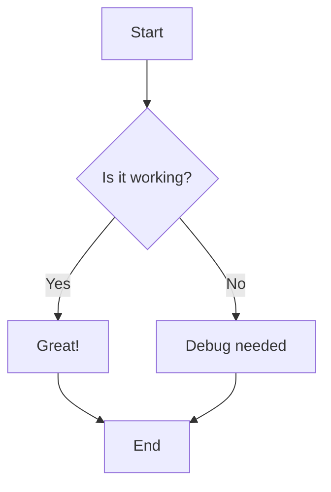
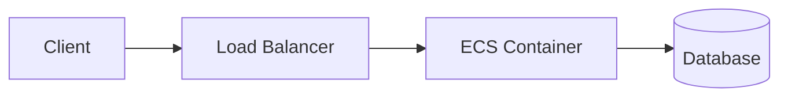
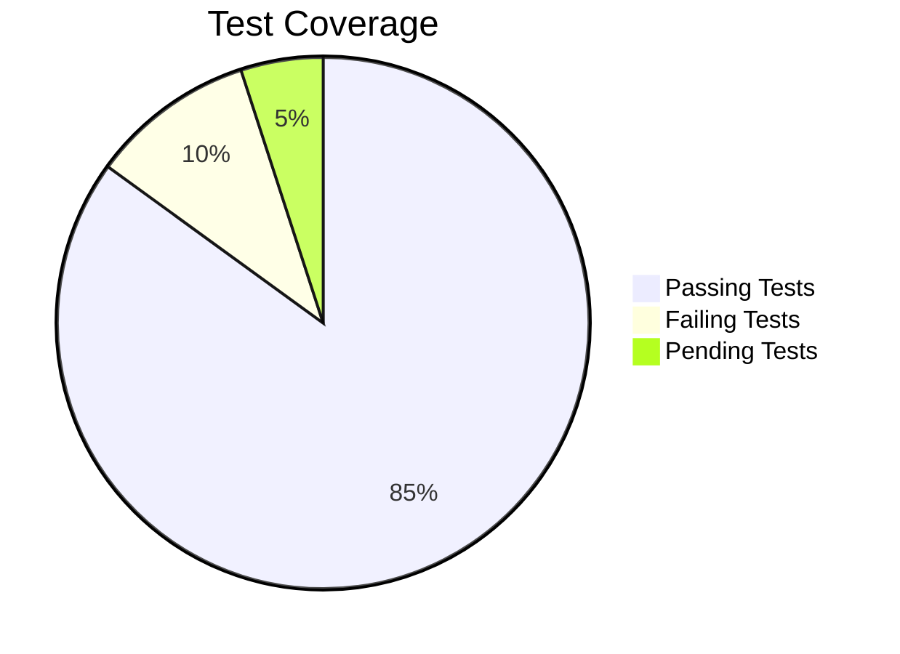

# 🧪 Mermaid Diagram Test

This page tests Mermaid diagram rendering functionality.

## Simple Flow Chart Test

## Architecture Test

## Pie Chart Test

---

If you see rendered diagrams above (not code blocks), Mermaid is working correctly!